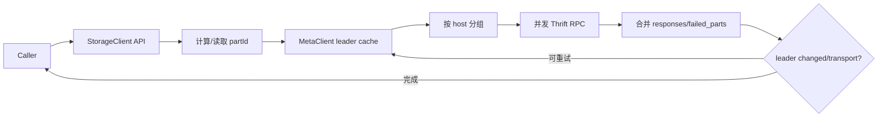

# clients 模块

## 职责

`src/clients` 封装服务间 RPC、连接池、路由、重试、超时、统计和响应归并。它不是外部 SDK；主要供 Graph、Storage、Meta 和工具内部使用。

## MetaClient

`clients/meta/MetaClient` 维护 Meta leader/active 地址，周期性 heartbeat，并把 space、schema、index、partition、listener、用户和配置加载为本地缓存。首次 `waitForMetadReady` 还执行版本校验与服务登记。缓存更新采用构造新快照再 diff 的方式，减少读线程看到半更新状态的风险。

## StorageClient

`StorageClientBase` 根据 VID/partId 和 Meta 缓存找到 leader，把批量请求按 host 分组并并发发送；返回后合并每个 partition 的响应。`StorageClient` 暴露图语义方法，`GeneralStorageClient` 提供泛化模板，`InternalStorageClient` 服务于 Storage 间事务。

## 接口约束

客户端只在明确可重试的错误上重试，并保留 partition 级错误；非幂等操作依赖服务端/Raft 语义避免重复副作用。连接与 Future 绑定 IO executor，调用方不能在其线程上做阻塞等待。

