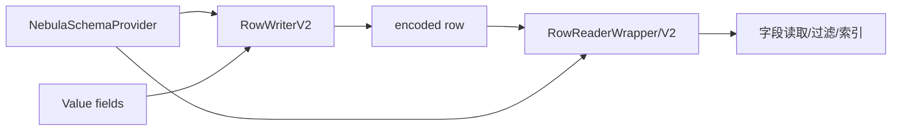

# codec 模块

## 职责

`src/codec` 根据 Meta schema 把属性行编码为紧凑二进制，或从二进制按字段名/索引读取 `Value`。它被 Storage 写入、过滤、投影、索引维护以及升级工具共同使用。

## V2 行布局

```text
[header + schema version][nullable bitmap][fixed-width fields][variable data][offset metadata]
```

`RowWriterV2` 预留定长区，逐字段校验类型/nullability 并写入；字符串、地理等变长值追加到尾部并在定长区记录位置。`finish` 处理缺省值、未设置字段和最终偏移。`RowReaderV2` 从 header 取得 schema version，由 `RowReaderWrapper` 选择对应 reader/schema。



## 约束

schema version 必须匹配编码头；null 位只分配给 nullable 字段；定长数值需做类型/范围检查；格式改变会影响磁盘兼容、备份恢复、升级工具与所有语言客户端的值语义，因此应通过版本化 reader/writer 演进。

