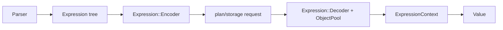

# common 模块

## 职责

`src/common` 是所有进程共享的基础层，既包含稳定的数据模型，也包含系统运行时工具。依赖方向原则上是上层模块依赖 common，而 common 不依赖 Graph/Meta/Storage 业务实现。

## 能力分组

| 目录 | 主要内容 |
| --- | --- |
| `datatypes` / `graph` | Value、Vertex、Edge、Path、DataSet 与操作语义 |
| `expression` / `function` | 表达式 AST、序列化、求值、标量/聚合函数注册 |
| `meta` / `context` | schema/index 抽象与表达式执行上下文 |
| `network` / `thrift` / `http` / `ssl` | 地址、RPC/HTTP 客户端和 TLS 配置 |
| `thread` / `memory` / `stats` | worker/pool、内存水位和指标 |
| `conf` / `log` / `process` / `fs` | 配置、日志、daemon、文件系统 |
| `time` / `geo` / `charset` | 时间、地理、字符集与排序规则 |
| `utils` | Nebula/Meta/Index key、默认值和通用转换 |

## 表达式流

`Expression::decode` 根据 Kind 创建具体节点并从字节流递归恢复。节点由 `ObjectPool` 统一拥有，适合查询级批量释放。`Value` 是跨模块核心变体，NULL、EMPTY 与 BAD NULL 的区分会影响表达式三值逻辑和属性写入。

## 修改注意

common 的序列化、ErrorCode、Value 比较/哈希和 key utils 都属于磁盘或协议兼容边界。修改前应追踪 Graph、Storage、Meta、客户端生成代码及升级工具的全部消费者。

