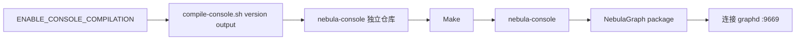

# console 模块

## 职责

当前仓库不包含 Console 的 Go 源码，`src/console` 只提供可选构建接入。`ENABLE_CONSOLE_COMPILATION` 启用后，脚本按指定分支克隆 `vesoft-inc/nebula-console`，执行其构建并把二进制复制到打包目录。

Console 是外部客户端，只调用 `GraphService`，不直接访问 Meta/Storage。构建脚本使用 `&&` 保证 clone、make、copy 任一步失败都不会伪造成功产物；版本参数应与服务端发布线相匹配。

