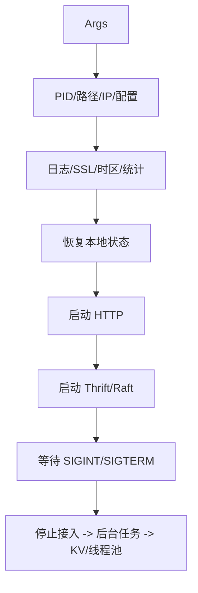

# daemons 模块

## 职责

`src/daemons` 负责可执行进程的生命周期和组件装配，不承载具体查询或存储算法。所有入口遵循参数解析、PID/daemon、日志与崩溃处理、网络/时区校验、服务装配、信号关闭的顺序。

## 入口

| 文件 | 产物 | 装配对象 |
| --- | --- | --- |
| `GraphDaemon.cpp` | `nebula-graphd` | WebService、GraphServer/GraphService |
| `MetaDaemon.cpp` | `nebula-metad` | Meta KV、WebService、JobManager、MetaServiceHandler |
| `StorageDaemon.cpp` | `nebula-storaged` | StorageServer、KV/Raft、Storage handlers |
| `StandAloneDaemon.cpp` | `nebula-standalone` | 同进程的 Graph、Meta、Storage |
| `MetaDaemonInit.*` | Meta 初始化辅助 | cluster id、god user、版本升级、Web 路由 |

## 关闭顺序

先停止接收新 RPC，再通知 worker/JobManager，最后停止 KVStore/Raft 和线程池。破坏顺序可能导致 Future 回调访问已析构的 MetaClient、KVStore 或统计对象。

