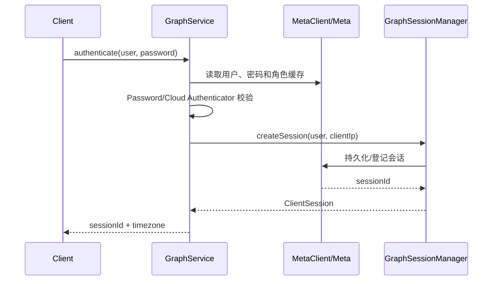
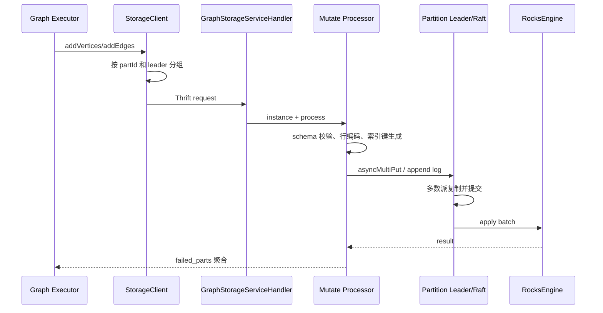
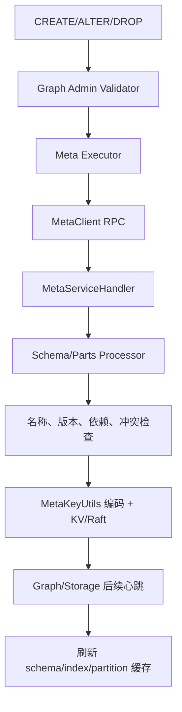
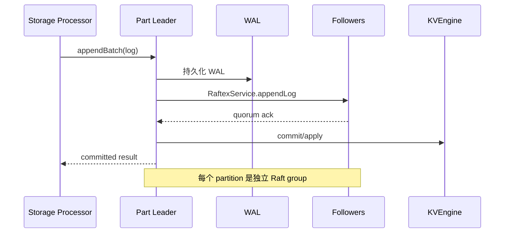
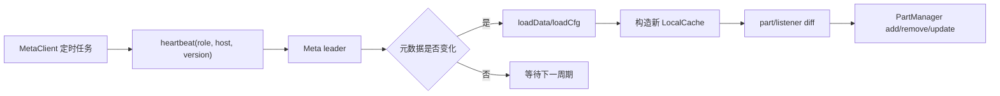
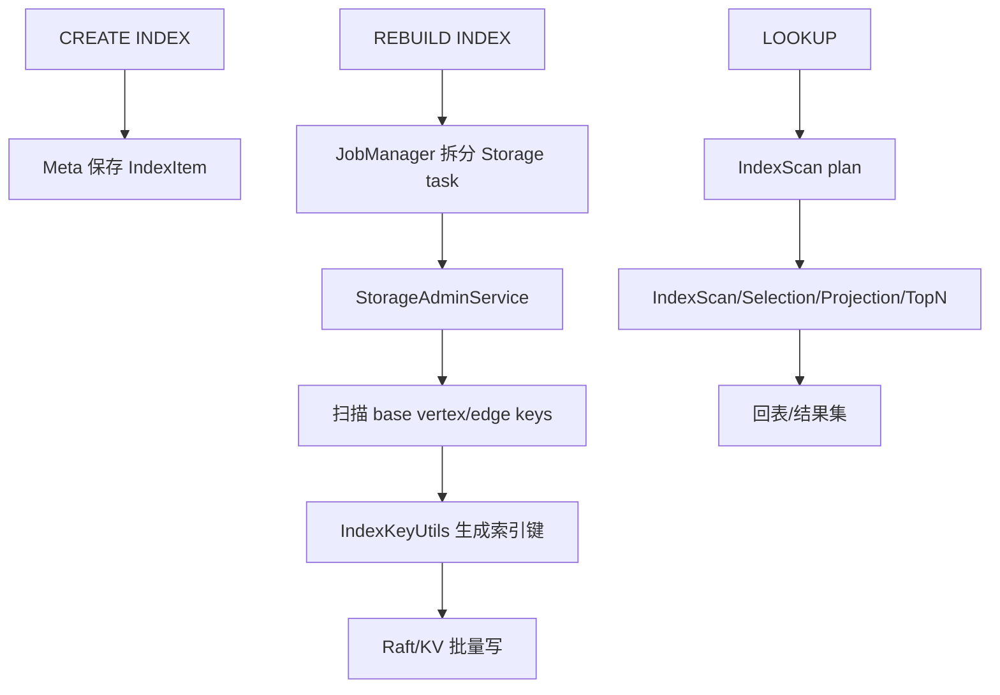
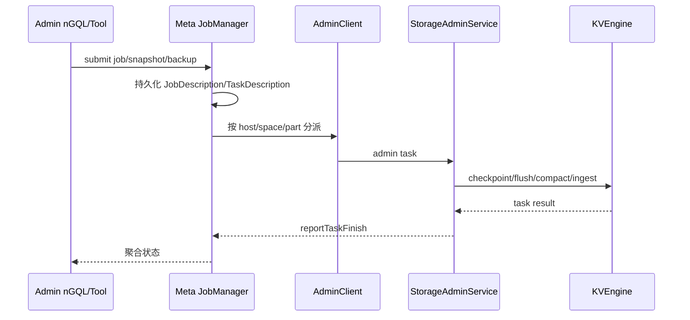
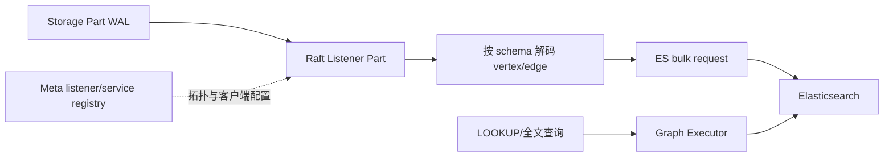

# 能力数据流程图

本页按用户可感知能力汇总端到端数据流。各模块页还有更小粒度的内部流程图。

## 1. 登录与会话

## 2. nGQL 查询

```mermaid
flowchart LR
    RPC["execute(sessionId, nGQL)"] --> Session["查找会话/space/权限"]
    Session --> Parse["Scanner + Parser -> AST"]
    Parse --> Validate["Validator: 语义、schema、权限"]
    Validate --> Plan["Planner -> Logical Plan DAG"]
    Plan --> Opt["Rule Optimizer"]
    Opt --> Schedule["Scheduler + Executors"]
    Schedule --> Client["StorageClient 按 partition 分发"]
    Client --> Proc["Storage Query Processor"]
    Proc --> KV["KV prefix/range/index scan"]
    KV --> Merge["Graph 合并 DataSet/路径"]
    Merge --> Resp["ExecutionResponse"]
```

## 3. 顶点/边写入

## 4. Schema 与 space 变更

## 5. 邻接与属性读取

```mermaid
flowchart LR
    Executor -->|"VID/edge key"| StorageClient
    StorageClient -->|"按 leader fan-out"| GetNeighbors["GetNeighbors/GetProp Processor"]
    GetNeighbors --> Plan["StoragePlan DAG"]
    Plan --> Scan["Vertex/Edge/Index Node"]
    Scan --> Rocks["RocksDB prefix/range scan"]
    Rocks --> Filter["TTL + predicate + projection"]
    Filter --> Dataset["按 part 返回 DataSet"]
    Dataset --> Merge["Graph merge/dedup/order/limit"]
```

## 6. 分区写入与 Raft 复制

## 7. Meta 心跳与路由刷新

## 8. 索引查询与重建

## 9. 备份、快照与管理作业

## 10. Listener 与全文索引同步

