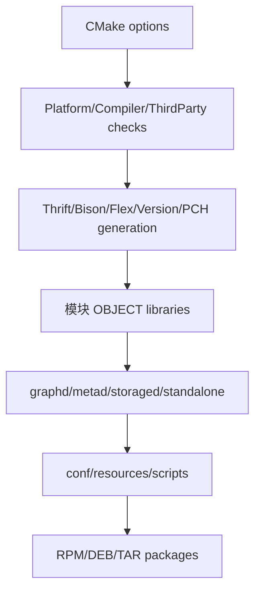

# 工程、部署与测试模块

## 目录职责

| 目录 | 职责 |
| --- | --- |
| `cmake` / 根 `CMakeLists.txt` | 平台检查、编译器、third-party、生成器、目标和打包开关 |
| `conf` | graphd/metad/storaged/standalone 默认配置模板 |
| `resources` | 服务、日志轮转等安装资源 |
| `scripts` | 服务管理、安装后辅助脚本 |
| `docker` | 编译和运行容器定义 |
| `package` | RPM/DEB/TAR 组件与 CPack 元数据 |
| `tests` | 跨模块 feature/TCK 和集成测试入口 |
| `third-party` | 外部依赖描述或子模块，不做业务注释 |
| `.github` / `.linters` | CI、格式、license 与静态检查 |

## 构建依赖流

`src/daemons/CMakeLists.txt` 最直观地展示最终二进制聚合了哪些 object library。构建生成文件位于 build tree，不应提交。配置项同时可能存在于默认 conf、gflags 声明和 Meta 动态配置中，修改时需保证名称、默认值和动态修改策略一致。

## 测试层次

- 模块目录下 `test`：类和 Processor 的单元测试。
- `src/mock`：真实 handler/KV/Raft 的轻量装配。
- 根 `tests`：nGQL feature、行为兼容和多服务集成。
- benchmark/perf：性能基线，不应替代正确性测试。

提交前至少执行格式/空白检查、Markdown/Mermaid 结构检查；若具备 Linux third-party 环境，再执行受影响模块的 CMake build 与测试目标。

