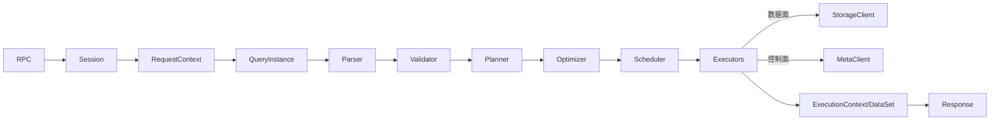

# graph 模块

## 职责与边界

`src/graph` 是无状态查询计算层。它接收带 session 的 nGQL，将文本转成物理执行计划，调用 Meta/Storage，最后组装 `ExecutionResponse`。业务数据不在 Graph 本地持久化；本地状态主要是会话、元数据缓存、执行上下文和统计。

## 子模块

| 目录 | 作用 |
| --- | --- |
| `service` / `session` | RPC、认证、会话、QueryEngine/QueryInstance |
| `validator` | 类型、schema、权限、语义校验，生成可规划语句上下文 |
| `planner` | 按语句类型构建 PlanNode DAG |
| `optimizer` | 基于规则改写执行计划 |
| `scheduler` / `executor` | 分析依赖并异步执行算子 |
| `context` | QueryContext、ExecutionContext、Iterator 和结果变量 |
| `visitor` / `util` / `gc` | AST/计划访问、辅助逻辑与延迟回收 |

## 关键入口

- `GraphService::future_authenticate`：认证后创建集群会话。
- `GraphService::future_executeWithParameter`：恢复 session，构造 RequestContext。
- `QueryEngine::execute`：创建 QueryContext 与 QueryInstance。
- `QueryInstance`：串联 parse、validate、plan、optimize、schedule 和错误收敛。
- `Scheduler::analyzeLifetime`：计算计划变量的消费计数和循环生命周期。
- 各 `Executor::execute`：执行本地算子或通过 StorageClient 发起远程数据操作。

## 数据流

## 失败与一致性

语法/语义错误在访问 Storage 前返回；Storage 的部分分区错误放入 `failed_parts` 并由客户端决定重试；执行期异常统一映射为 Graph ErrorCode。Graph 的 Meta 缓存可能短暂落后，leader/schema 变化通过返回码、心跳和重新规划收敛。

## 阅读建议

以 `service/GraphService.cpp` 为入口，随后按 `QueryInstance.cpp` 中的阶段顺序阅读。具体语句从 `validator/*` 对应类跳到 `planner/*` 和同名 `executor/*`，比按目录顺序通读更高效。

