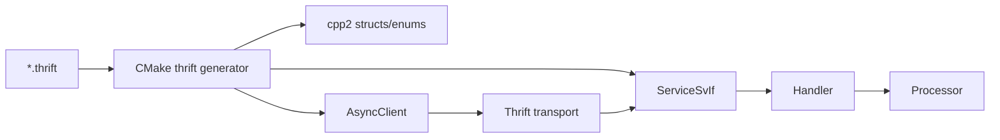

# interface 模块

## 职责

`src/interface` 是跨进程兼容性的源头。Thrift 文件定义 Graph、Meta、Storage、Raft 服务，以及请求、响应、枚举和公共数据结构；CMake 在构建时生成 C++ 类型与异步客户端/服务端基类。

## 文件

| 文件 | 内容 |
| --- | --- |
| `common.thrift` | ErrorCode、Value、HostAddr、Date/Path/DataSet 等公共值 |
| `graph.thrift` | 外部认证、会话执行和版本校验 |
| `meta.thrift` | 全部控制面 API 与元数据结构 |
| `storage.thrift` | 图数据面、管理面和内部事务 API |
| `raftex.thrift` | Raft append log、vote、snapshot 等共识消息 |
| `graph_v2.thrift` / `meta_v2.thrift` | 兼容或升级读取所需的旧版契约 |

## 生成与调用

## 兼容规则

字段编号是线协议身份，已发布字段不可改号或复用；新增可选字段优先于改变必填字段；ErrorCode 同时被客户端重试、Graph 错误映射和运维工具消费。修改接口后需验证全部生成目标、客户端与 Handler 签名，并考虑滚动升级期间的新旧进程互通。

