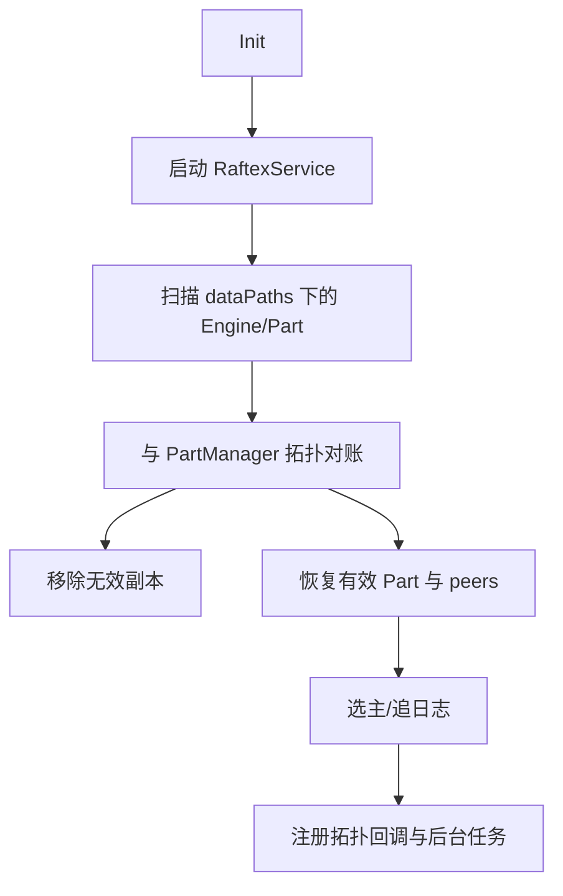

# kvstore 模块

## 职责与边界

`src/kvstore` 提供按 graph space/partition 组织的分布式 KV 抽象。上层只看到 `KVStore` 的 get、range、prefix、asyncMultiPut、atomicOp 等接口；内部由 `NebulaStore` 管理 Engine、Part、Raft、WAL、snapshot 与 listener。

## 主要对象

- `NebulaStore`：space/engine/part 的拥有者和拓扑回调接收者。
- `Part`：单 partition 的 Raft 状态机，把已提交日志应用到 KVEngine。
- `RaftexService` / `RaftPart`：多 group 共识、选主、日志复制和成员变更。
- `WAL`：提交前持久化日志、term/index 与过期清理。
- `RocksEngine`：RocksDB 适配、batch、iterator、checkpoint、compaction。
- `PartManager`：来自 Meta 的权威 topology 视图。
- `Listener`：消费 Raft/WAL 并投递外部系统。

## 启动恢复

## 写路径

leader 将 batch 编码为日志写 WAL，经 RaftexService 复制到多数副本，commit index 推进后调用状态机应用到 Engine。Follower 不直接接受业务写，调用方根据 `E_LEADER_CHANGED` 更新缓存。不同 partition 拥有独立 Raft group，可并行复制。

## 磁盘布局与生命周期

一个 data path 可承载多个 space Engine；Engine 内含多个 Part。启动时以 Meta 为最终权威，但会优先识别 balancing 中的临时分片，避免迁移过程误删。snapshot/checkpoint 用于追赶和备份，WAL 清理只删除安全提交点之前且超过 TTL 的日志。

