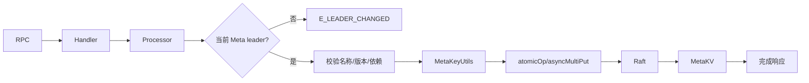

# meta 模块

## 职责与边界

`src/meta` 是集群控制面。它管理 space、partition、zone/host、tag/edge schema、索引、用户角色、配置、会话、listener、备份快照和后台作业。权威状态以 `MetaKeyUtils` 规定的键布局写入 Meta KVStore，并由 Meta Raft group 复制。

## 核心结构

- `MetaServiceHandler`：实现 Thrift 接口，仅分派请求。
- `BaseProcessor` 与 `processors/*`：每个 RPC 的校验、leader 约束、KV 读写和响应生命周期。
- `ActiveHostsMan`：基于心跳维护服务活性。
- `AdminClient`：从 Meta 向 StorageAdminService 分派管理命令。
- `JobManager`：持久化 job/task 状态，调度 balance、rebuild、compact、stats 等任务。
- `MetaVersionMan` / `upgrade`：识别并迁移元数据格式。

## Processor 分类

| 分类 | 代表能力 |
| --- | --- |
| `parts` / `zone` | space、host、partition 分配和 zone 拓扑 |
| `schema` / `index` | tag、edge、原生索引、全文索引 |
| `user` / `session` | 认证、授权、会话与查询登记 |
| `config` | 动态配置注册、查询和修改 |
| `job` / `admin` | balance、rebuild、snapshot、backup、restore |
| `listener` / `service` | listener 与外部服务注册 |

## 写请求流程

## 关键约束

删除 schema/space 前需检查索引和作业等依赖；拓扑变更需要同时维护 host/zone/part 映射；长任务先落 JobDescription，再分派 Storage task，服务重启后可从持久状态恢复。Graph/Storage 不直接读取 Meta RocksDB，而通过 RPC 与心跳缓存消费控制面。

