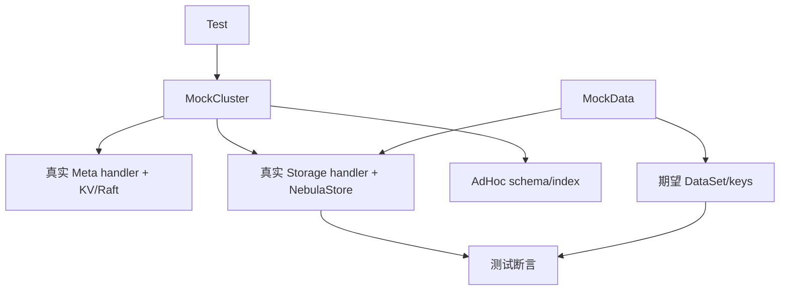

# mock 模块

## 职责

`src/mock` 为单元/集成测试提供最小但接近生产的 Graph、Meta、Storage 装配。它既有内存 schema/index manager，也能启动真实 NebulaStore、Raft、MetaServiceHandler 和 Storage Handler。

## 核心对象

- `MockCluster`：创建 Meta KV、Storage KV、RPC server、MetaClient 和可选 listener。
- `MockData`：篮球图 schema、vertex/edge、索引键及各类 Thrift request。
- `AdHocSchemaManager` / `AdHocIndexManager`：无需 Meta RPC 的测试元数据。
- `RpcServer` / `LocalServer` / `FakeHttpServer`：替代部署环境的边界。

测试写入前应等待所有 Part 完成选主，以免把启动竞态误判为功能失败。修改 MockData 时要保持 VID、partition 计算、正反向边和索引键之间的一致性。

