# NebulaGraph 3.6 Graph 模块源码深度解析

> 仓库：`Bewear777/nebula`  
> 分支：`release-3.6`  
> 源码快照 Commit：`de9b3ed800a6627d9845e9289b6bbc5b6faf460a`  
> 分析范围：`src/graph`，重点覆盖 **执行计划节点（PlanNode）/ 执行算子（Executor）/ Scheduler / Optimizer / Rule / Validator / Planner / ExecutionContext 数据流**。  
> 目标：既可用于阅读源码，也可用于 `EXPLAIN/PROFILE`、Graph CPU、Storage RPC、慢查询和执行计划问题定位。

---

## 目录

1. [先给结论：Graph 模块到底怎么跑一条查询](#1-先给结论graph-模块到底怎么跑一条查询)
2. [源码目录与角色](#2-源码目录与角色)
3. [PlanNode 的核心模型：控制流、数据流、变量](#3-plannode-的核心模型控制流数据流变量)
4. [全量 PlanNode 清单：136 个非 Unknown 节点](#4-全量-plannode-清单136-个非-unknown-节点)
5. [查询节点与 Executor 逐类解析](#5-查询节点与-executor-逐类解析)
6. [维护/写入/Admin 节点与 Executor 映射](#6-维护写入admin-节点与-executor-映射)
7. [Validator 与 Planner：AST 如何变成执行计划](#7-validator-与-plannerast-如何变成执行计划)
8. [Executor 工厂、ExecutionContext 与结果生命周期](#8-executor-工厂executioncontext-与结果生命周期)
9. [Scheduler：Executor DAG 如何异步执行](#9-schedulerexecutor-dag-如何异步执行)
10. [Optimizer：Memo/Group/Pattern/Rule 的完整机制](#10-optimizermemogrouppatternrule-的完整机制)
11. [release-3.6 优化规则全集](#11-release-36-优化规则全集)
12. [关键源码方法逐行解析](#12-关键源码方法逐行解析)
13. [核心算子源码深挖](#13-核心算子源码深挖)
14. [典型 nGQL/MATCH 的调用关系](#14-典型-ngqlmatch-的调用关系)
15. [性能分析视角：哪些算子吃 Graph CPU，哪些压 Storage](#15-性能分析视角哪些算子吃-graph-cpu哪些压-storage)
16. [源码阅读索引](#16-源码阅读索引)
17. [结论与后续扩展点](#17-结论与后续扩展点)

---
## 1. 先给结论：Graph 模块到底怎么跑一条查询

Graphd 并不是“收到 nGQL 后直接逐句解释执行”。在 3.6 中，一条查询大致经历下面的阶段：

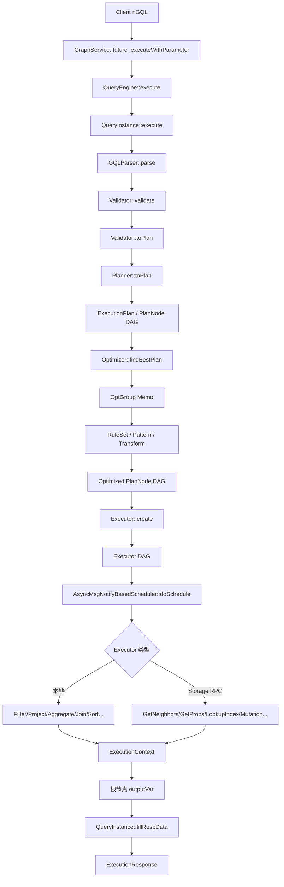

最重要的四个概念：

- **PlanNode**：计划中的“做什么”，例如 `GetNeighbors`、`Filter`、`Project`。
- **Executor**：运行时真正执行 PlanNode 的“算子”，例如 `GetNeighborsExecutor`、`FilterExecutor`。
- **Variable / ExecutionContext**：节点之间并不是直接传 C++ DataSet，而是通过 `outputVar/inputVar` 在执行上下文中读写结果。
- **Optimizer Rule**：不是直接修改一棵树，而是先把计划转换为 `OptGroup/OptGroupNode` Memo，再按 Pattern 匹配、Transform、替换/增加等价节点。

这四者一旦串起来，Graph 模块的绝大多数源码就能放进同一张图中理解。

---
## 2. 源码目录与角色

| 层次 | 主要路径 | 作用 |
| --- | --- | --- |
| PlanNode 核心 | src/graph/planner/plan/PlanNode.h/.cpp | Kind 全集、依赖/变量模型、explain、symbol 生命周期 |
| Query 节点 | src/graph/planner/plan/Query.h/.cpp | GetNeighbors/Traverse/IndexScan/Filter/Project/Join 等 |
| Scan 逻辑节点 | src/graph/planner/plan/Scan.h | Tag/Edge Full/Prefix/Range IndexScan |
| 算法节点 | src/graph/planner/plan/Algo.h/.cpp | Shortest/AllPaths/Subgraph/CartesianProduct |
| 逻辑节点 | src/graph/planner/plan/Logic.h/.cpp | Start/Select/Loop/Argument |
| 写节点 | src/graph/planner/plan/Mutate.h/.cpp | Insert/Update/Delete |
| 维护节点 | src/graph/planner/plan/Maintain.h/.cpp | Schema/Index/Job/Show 等 |
| 执行计划 | src/graph/planner/plan/ExecutionPlan.cpp | EXPLAIN/PROFILE 描述、branch info |
| Validator | src/graph/validator/Validator.cpp | Sentence→Validator→AstContext→Planner |
| Planner | src/graph/planner/Planner.cpp | Planner 注册选择、transform |
| Executor 基类/工厂 | src/graph/executor/Executor.h/.cpp | PlanNode→Executor、生命周期、profile、并行 jobs |
| StorageAccessExecutor | src/graph/executor/StorageAccessExecutor.cpp | VID request 构造、Storage 响应处理 |
| Scheduler | src/graph/scheduler/Scheduler.cpp | 变量生命周期分析 |
| Async Scheduler | src/graph/scheduler/AsyncMsgNotifyBasedScheduler.cpp | Promise/Future DAG 调度 |
| Optimizer | src/graph/optimizer/Optimizer.cpp | 入口、Memo、RuleSet 探索、postprocess |
| OptGroup | src/graph/optimizer/OptGroup.cpp | Memo group、rule exploration、cost selection |
| OptRule | src/graph/optimizer/OptRule.cpp | Pattern match、dataflow guard、RuleSet |
| Optimizer rules | src/graph/optimizer/rule/*.cpp | 57 个 distinct 编译单元/规则实现 |
| Query Engine | src/graph/service/QueryEngine.cpp | Planner 注册、RuleSet 顺序、QueryContext/QueryInstance |
| Query Instance | src/graph/service/QueryInstance.cpp | parse→validate→optimize→schedule→response |

`src/graph` 还包含 `context/`、`visitor/`、`util/`、`session/`、`stats/`、`gc/` 等支撑模块。执行计划最核心的纵向主链是：

`service -> validator -> planner -> plan -> optimizer -> executor -> scheduler -> context -> response`。

---
## 3. PlanNode 的核心模型：控制流、数据流、变量

### 3.1 为什么 PlanNode 同时有 dependency 和 inputVar

这是阅读 NebulaGraph Graph 源码最容易混淆的一点。

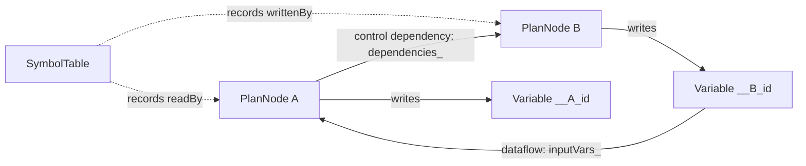

- `dependencies_`：**控制依赖**。A 必须等待 B 执行完成。
- `inputVars_`：**数据依赖**。A 从哪个 Variable 读取结果。
- 对普通 `SingleInputNode`，二者通常一一对应。
- 对 `Argument`、`Select`、`Loop`、某些 Join/Apply，控制流和数据流不完全同构，因此 Optimizer 和 Scheduler 都有专门逻辑。

### 3.2 PlanNode 构造时自动生成 outputVar

`PlanNode::PlanNode(QueryContext*, Kind)` 的行为可以抽象为：

```cpp
id_ = qctx_->genId();
varName = "__" + kind + "_" + id;
variable = symTable->newVariable(varName);
outputVar_ = variable;
symTable->writtenBy(varName, this);
```

因此每个节点天然拥有唯一输出变量。优化器 clone/rewrite 时，`setOutputVar()` 是否复用旧 outputVar 是**保持上层数据流不变**的关键。

### 3.3 四种常见节点基类

| 基类 | 控制依赖 | 数据输入 | 典型节点 | 源码含义 |
| --- | --- | --- | --- | --- |
| PlanNode | 0..N | 显式 | Start、Argument | 最基础节点；Argument 是特殊叶子 |
| SingleDependencyNode | 1 | 不一定读取 dep 输出 | Insert、Meta/Admin、InnerJoin 某些形态 | 只有“先后关系”也可建立依赖 |
| SingleInputNode | 1 | 默认读取 dep.outputVar | Filter、Project、GetNeighbors、Traverse | 最常见 pipeline 节点 |
| BinaryInputNode | 2 | 默认读取 left/right outputVar | Union、HashJoin、CrossJoin、AllPaths | 双输入数据流 |
| VariableDependencyNode | N | 显式多个 Variable | DataCollect | 收集多个变量/版本 |

### 3.4 SymbolTable 为什么对优化器非常重要

优化规则重写节点后不仅要保持树形结构正确，还必须维护：

- `Variable::writtenBy`：谁生产这个变量；
- `Variable::readBy`：谁消费这个变量；
- PlanNode `inputVar(i)` 是否等于其依赖 Group 的 `outputVar()`。

因此源码中会频繁看到：

- `readVariable()` / `setInputVar()`；
- `setOutputVar()`；
- `releaseSymbols()`；
- `updateSymbols()`。

这也是 `OptRule::match()` 里额外检查 dataflow/control-flow 一致性的根本原因。

---
## 4. 全量 PlanNode 清单：136 个非 Unknown 节点

`PlanNode::Kind` 在该源码快照中共有 **136 个非 `kUnknown` 类型**。下面按源码 enum 分组列全。

### 4.1 查询/数据访问

| Kind | PlanNode 类/族 | 依赖模型 | Executor | 主要压力位置 | 作用 |
| --- | --- | --- | --- | --- | --- |
| kGetNeighbors | GetNeighbors | SingleInputNode | GetNeighborsExecutor | Storage+Graph | 按输入 VID 调 Storage getNeighbors；返回邻接边/点属性、统计表达式等，是 GO/MATCH 扩展的基础 RPC 节点。 |
| kGetVertices | GetVertices | SingleInputNode | GetVerticesExecutor | Storage+Graph | 按 VID 获取点属性；通常调用 Storage getProps。 |
| kGetEdges | GetEdges | SingleInputNode | GetEdgesExecutor | Storage+Graph | 按 EdgeKey 获取边属性；通常调用 Storage getProps/getEdgeProps 路径。 |
| kExpand | Expand | SingleInputNode | ExpandExecutor | Storage+Graph | 邻接扩展节点，面向 MATCH/路径扩展；可携带 edgeTypes、stepLimits、sample/joinInput。 |
| kExpandAll | ExpandAll | SingleInputNode | ExpandAllExecutor | Storage+Graph | Expand 的增强形态，同时返回/拼装顶点与边列；常由 MATCH 计划使用。 |
| kTraverse | Traverse | SingleInputNode | TraverseExecutor | Storage+Graph | Graph 侧多步遍历。每一步发 getNeighbors RPC，Graph 侧维护下一跳 VID、邻接表并构造路径。 |
| kAppendVertices | AppendVertices | SingleInputNode | AppendVerticesExecutor | Storage+Graph | 在已有路径/边结果上补点属性，继承 GetVertices 的访问能力。 |
| kShortestPath | ShortestPath | SingleInputNode | ShortestPathExecutor | Storage+Graph | 单输入最短路径节点；保存 stepRange、边方向及点/边属性需求。 |
| kIndexScan | IndexScan | SingleInputNode | IndexScanExecutor | Storage+Graph | 通用索引扫描逻辑节点，保存 IndexQueryContext、返回列、schemaId、lazyIndexHint。 |
| kTagIndexFullScan | TagIndexFullScan | SingleInputNode | TagIndexFullScanExecutor | Storage+Graph | Tag 全索引扫描逻辑节点；最终由 IndexScanExecutor 统一执行。 |
| kTagIndexPrefixScan | TagIndexPrefixScan | SingleInputNode | TagIndexPrefixScanExecutor | Storage+Graph | Tag 前缀索引扫描逻辑节点；最终由 IndexScanExecutor 统一执行。 |
| kTagIndexRangeScan | TagIndexRangeScan | SingleInputNode | TagIndexRangeScanExecutor | Storage+Graph | Tag 范围索引扫描逻辑节点；最终由 IndexScanExecutor 统一执行。 |
| kEdgeIndexFullScan | EdgeIndexFullScan | SingleInputNode | EdgeIndexFullScanExecutor | Storage+Graph | Edge 全索引扫描逻辑节点；最终由 IndexScanExecutor 统一执行。 |
| kEdgeIndexPrefixScan | EdgeIndexPrefixScan | SingleInputNode | EdgeIndexPrefixScanExecutor | Storage+Graph | Edge 前缀索引扫描逻辑节点；最终由 IndexScanExecutor 统一执行。 |
| kEdgeIndexRangeScan | EdgeIndexRangeScan | SingleInputNode | EdgeIndexRangeScanExecutor | Storage+Graph | Edge 范围索引扫描逻辑节点；最终由 IndexScanExecutor 统一执行。 |
| kScanVertices | ScanVertices | SingleInputNode | ScanVerticesExecutor | Storage+Graph | 扫描点数据的 Storage 访问节点，可携带 props/expr/filter/limit。 |
| kScanEdges | ScanEdges | SingleInputNode | ScanEdgesExecutor | Storage+Graph | 扫描边数据的 Storage 访问节点，可携带 props/expr/filter/limit。 |
| kFulltextIndexScan | FulltextIndexScan | Explore/特殊构造 | FulltextIndexScanExecutor | Storage+Graph | 全文索引查询节点；保存 TextSearchExpression、schemaId、limit/offset。 |
| kValue | ValueNode | SingleInputNode | ValueExecutor | Meta/Admin/轻量本地 | 常量/直接 DataSet 结果节点，用于计划中注入已知值。 |
| kFilter | Filter | SingleInputNode | FilterExecutor | Graph CPU | Graph 本地过滤；逐行计算 Expression，支持原地 erase 或复制，并可并行分批。 |
| kUnion | Union | BinaryInputNode | UnionExecutor | Meta/Admin/轻量本地 | 两个输入结果集合并（去重语义由对应执行器实现）。 |
| kUnionAllVersionVar | UnionAllVersionVar | SingleInputNode | UnionAllVersionVarExecutor | Meta/Admin/轻量本地 | 收集某变量多个版本的结果。 |
| kIntersect | Intersect | BinaryInputNode | IntersectExecutor | Meta/Admin/轻量本地 | 两个结果集求交。 |
| kMinus | Minus | BinaryInputNode | MinusExecutor | Meta/Admin/轻量本地 | 两个结果集求差。 |
| kProject | Project | SingleInputNode | ProjectExecutor | Graph CPU | Graph 本地投影；逐行计算 YieldColumns 表达式并生成新 DataSet。 |
| kUnwind | Unwind | SingleInputNode | UnwindExecutor | Meta/Admin/轻量本地 | 把 List 展开为行。 |
| kSort | Sort | SingleInputNode | SortExecutor | Graph CPU | Graph 本地排序。 |
| kTopN | TopN | SingleInputNode | TopNExecutor | Graph CPU | 排序+截断的组合节点，常由 Limit<-Sort 优化得到。 |
| kLimit | Limit | SingleInputNode | LimitExecutor | Meta/Admin/轻量本地 | offset/count 截断。 |
| kSample | Sample | SingleInputNode | SampleExecutor | Meta/Admin/轻量本地 | 随机/采样行。 |
| kAggregate | Aggregate | SingleInputNode | AggregateExecutor | Graph CPU | Graph 本地 hash aggregation；group key 为 List，聚合状态为 AggData。 |
| kDedup | Dedup | SingleInputNode | DedupExecutor | Graph CPU | Graph 本地去重。 |
| kAssign | Assign | SingleInputNode | AssignExecutor | Meta/Admin/轻量本地 | 把表达式结果绑定到变量。 |
| kBFSShortest | BFSShortestPath | BinaryInputNode | BFSShortestPathExecutor | Storage+Graph | 双输入 BFS 最短路径中间节点。 |
| kMultiShortestPath | MultiShortestPath | BinaryInputNode | MultiShortestPathExecutor | Storage+Graph | 多对最短路径中间节点。 |
| kAllPaths | AllPaths | BinaryInputNode | AllPathsExecutor | Storage+Graph | 双输入所有路径算法节点，可配置 noLoop/filter/stepFilter/limit。 |
| kCartesianProduct | CartesianProduct | SingleDependencyNode | CartesianProductExecutor | Graph CPU | 按多个变量输入构造笛卡尔积。 |
| kSubgraph | Subgraph | SingleInputNode | SubgraphExecutor | Storage+Graph | 子图扩展；保存 tag/edge/filter、步数和属性请求。 |
| kDataCollect | DataCollect | VariableDependencyNode | DataCollectExecutor | Meta/Admin/轻量本地 | 收集多个变量/子计划结果，按 DCKind 采用不同收集方式。 |
| kInnerJoin | InnerJoin | SingleDependencyNode | InnerJoinExecutor | Graph CPU | 基于变量结果做内连接；依赖一个控制节点但显式引用左右变量版本。 |
| kHashLeftJoin | HashLeftJoin | BinaryInputNode | HashLeftJoinExecutor | Graph CPU | 双输入 hash left join。 |
| kHashInnerJoin | HashInnerJoin | BinaryInputNode | HashInnerJoinExecutor | Graph CPU | 双输入 hash inner join。 |
| kCrossJoin | CrossJoin | BinaryInputNode | CrossJoinExecutor | Graph CPU | 双输入笛卡尔连接。 |
| kRollUpApply | RollUpApply | BinaryInputNode | RollUpApplyExecutor | Graph CPU | Apply 类算子，把右侧子计划结果 roll-up 为 List 后与左侧关联。 |
| kPatternApply | PatternApply | BinaryInputNode | PatternApplyExecutor | Graph CPU | 用于 pattern predicate 的 Apply 节点，可做 anti predicate。 |
| kArgument | Argument | PlanNode(特殊叶子) | ArgumentExecutor | Meta/Admin/轻量本地 | 相关子查询/MATCH 右侧从外层读取别名；无普通 dep，由 SymbolTable 和 Scheduler 特殊解析生产者。 |

### 4.2 逻辑控制

| Kind | PlanNode 类/族 | 依赖模型 | Executor | 主要压力位置 | 作用 |
| --- | --- | --- | --- | --- | --- |
| kSelect | Select | SingleInputNode + then/else body | SelectExecutor | Meta/Admin/轻量本地 | 运行时计算条件，只调度 then/else 其中一个 body。 |
| kLoop | Loop | SingleInputNode + body | LoopExecutor | Meta/Admin/轻量本地 | 运行时条件循环；body 作为特殊子计划递归调度。 |
| kPassThrough | PassThroughNode | SingleInputNode | PassThroughExecutor | Meta/Admin/轻量本地 | 透传控制/结果的辅助节点。 |
| kStart | StartNode | PlanNode(叶子) | StartExecutor | Meta/Admin/轻量本地 | 调度叶子节点，SubPlan 尾部的标准起点。 |

### 4.3 Schema/Space

| Kind | PlanNode 类/族 | 依赖模型 | Executor | 主要压力位置 | 作用 |
| --- | --- | --- | --- | --- | --- |
| kCreateSpace | CreateSpace | 多为 SingleDependencyNode / 维护类基类 | CreateSpaceExecutor | Meta/Admin/轻量本地 | 创建 Space 元数据 |
| kCreateSpaceAs | CreateSpaceAs | 多为 SingleDependencyNode / 维护类基类 | CreateSpaceAsExecutor | Meta/Admin/轻量本地 | 基于已有 Space 创建 |
| kCreateTag | CreateTag | 多为 SingleDependencyNode / 维护类基类 | CreateTagExecutor | Meta/Admin/轻量本地 | 创建 Tag Schema |
| kCreateEdge | CreateEdge | 多为 SingleDependencyNode / 维护类基类 | CreateEdgeExecutor | Meta/Admin/轻量本地 | 创建 Edge Schema |
| kDescSpace | DescSpace | 多为 SingleDependencyNode / 维护类基类 | DescSpaceExecutor | Meta/Admin/轻量本地 | 查询 Space 定义 |
| kShowCreateSpace | ShowCreateSpace | 多为 SingleDependencyNode / 维护类基类 | ShowCreateSpaceExecutor | Meta/Admin/轻量本地 | 生成 CREATE SPACE 描述 |
| kDescTag | DescTag | 多为 SingleDependencyNode / 维护类基类 | DescTagExecutor | Meta/Admin/轻量本地 | 查询 Tag 定义 |
| kDescEdge | DescEdge | 多为 SingleDependencyNode / 维护类基类 | DescEdgeExecutor | Meta/Admin/轻量本地 | 查询 Edge 定义 |
| kAlterTag | AlterTag | 多为 SingleDependencyNode / 维护类基类 | AlterTagExecutor | Meta/Admin/轻量本地 | 修改 Tag Schema |
| kAlterEdge | AlterEdge | 多为 SingleDependencyNode / 维护类基类 | AlterEdgeExecutor | Meta/Admin/轻量本地 | 修改 Edge Schema |
| kShowSpaces | ShowSpaces | 多为 SingleDependencyNode / 维护类基类 | ShowSpacesExecutor | Meta/Admin/轻量本地 | 列出 Space |
| kSwitchSpace | SwitchSpace | 多为 SingleDependencyNode / 维护类基类 | SwitchSpaceExecutor | Meta/Admin/轻量本地 | 切换当前 Session 的 Space |
| kShowTags | ShowTags | 多为 SingleDependencyNode / 维护类基类 | ShowTagsExecutor | Meta/Admin/轻量本地 | 列出 Tag |
| kShowEdges | ShowEdges | 多为 SingleDependencyNode / 维护类基类 | ShowEdgesExecutor | Meta/Admin/轻量本地 | 列出 Edge |
| kShowCreateTag | ShowCreateTag | 多为 SingleDependencyNode / 维护类基类 | ShowCreateTagExecutor | Meta/Admin/轻量本地 | 展示 CREATE TAG |
| kShowCreateEdge | ShowCreateEdge | 多为 SingleDependencyNode / 维护类基类 | ShowCreateEdgeExecutor | Meta/Admin/轻量本地 | 展示 CREATE EDGE |
| kDropSpace | DropSpace | 多为 SingleDependencyNode / 维护类基类 | DropSpaceExecutor | Meta/Admin/轻量本地 | 删除 Space |
| kClearSpace | ClearSpace | 多为 SingleDependencyNode / 维护类基类 | ClearSpaceExecutor | Meta/Admin/轻量本地 | 清理 Space 数据 |
| kDropTag | DropTag | 多为 SingleDependencyNode / 维护类基类 | DropTagExecutor | Meta/Admin/轻量本地 | 删除 Tag |
| kDropEdge | DropEdge | 多为 SingleDependencyNode / 维护类基类 | DropEdgeExecutor | Meta/Admin/轻量本地 | 删除 Edge |
| kAlterSpace | AlterSpace | 多为 SingleDependencyNode / 维护类基类 | AlterSpaceExecutor | Meta/Admin/轻量本地 | 修改 Space |

### 4.4 索引/Job

| Kind | PlanNode 类/族 | 依赖模型 | Executor | 主要压力位置 | 作用 |
| --- | --- | --- | --- | --- | --- |
| kCreateTagIndex | CreateTagIndex | 多为 SingleDependencyNode / 维护类基类 | CreateTagIndexExecutor | Meta/Admin/轻量本地 | 创建 Tag 索引 |
| kCreateEdgeIndex | CreateEdgeIndex | 多为 SingleDependencyNode / 维护类基类 | CreateEdgeIndexExecutor | Meta/Admin/轻量本地 | 创建 Edge 索引 |
| kCreateFTIndex | CreateFTIndex | 多为 SingleDependencyNode / 维护类基类 | CreateFTIndexExecutor | Meta/Admin/轻量本地 | 创建全文索引 |
| kDropFTIndex | DropFTIndex | 多为 SingleDependencyNode / 维护类基类 | DropFTIndexExecutor | Meta/Admin/轻量本地 | 删除全文索引 |
| kDropTagIndex | DropTagIndex | 多为 SingleDependencyNode / 维护类基类 | DropTagIndexExecutor | Meta/Admin/轻量本地 | 删除 Tag 索引 |
| kDropEdgeIndex | DropEdgeIndex | 多为 SingleDependencyNode / 维护类基类 | DropEdgeIndexExecutor | Meta/Admin/轻量本地 | 删除 Edge 索引 |
| kDescTagIndex | DescTagIndex | 多为 SingleDependencyNode / 维护类基类 | DescTagIndexExecutor | Meta/Admin/轻量本地 | 描述 Tag 索引 |
| kDescEdgeIndex | DescEdgeIndex | 多为 SingleDependencyNode / 维护类基类 | DescEdgeIndexExecutor | Meta/Admin/轻量本地 | 描述 Edge 索引 |
| kShowCreateTagIndex | ShowCreateTagIndex | 多为 SingleDependencyNode / 维护类基类 | ShowCreateTagIndexExecutor | Meta/Admin/轻量本地 | 展示 CREATE TAG INDEX |
| kShowCreateEdgeIndex | ShowCreateEdgeIndex | 多为 SingleDependencyNode / 维护类基类 | ShowCreateEdgeIndexExecutor | Meta/Admin/轻量本地 | 展示 CREATE EDGE INDEX |
| kShowTagIndexes | ShowTagIndexes | 多为 SingleDependencyNode / 维护类基类 | ShowTagIndexesExecutor | Meta/Admin/轻量本地 | 列 Tag 索引 |
| kShowEdgeIndexes | ShowEdgeIndexes | 多为 SingleDependencyNode / 维护类基类 | ShowEdgeIndexesExecutor | Meta/Admin/轻量本地 | 列 Edge 索引 |
| kShowTagIndexStatus | ShowTagIndexStatus | 多为 SingleDependencyNode / 维护类基类 | ShowTagIndexStatusExecutor | Meta/Admin/轻量本地 | 索引构建状态 |
| kShowEdgeIndexStatus | ShowEdgeIndexStatus | 多为 SingleDependencyNode / 维护类基类 | ShowEdgeIndexStatusExecutor | Meta/Admin/轻量本地 | 索引构建状态 |
| kInsertVertices | InsertVertices | SingleDependencyNode | InsertVerticesExecutor | Storage write | 写点到 Storage |
| kInsertEdges | InsertEdges | SingleDependencyNode | InsertEdgesExecutor | Storage write | 写边到 Storage |
| kSubmitJob | SubmitJob | 多为 SingleDependencyNode / 维护类基类 | SubmitJobExecutor | Meta/Admin/轻量本地 | 向 Meta 提交后台 Job |
| kShowHosts | ShowHosts | 多为 SingleDependencyNode / 维护类基类 | ShowHostsExecutor | Meta/Admin/轻量本地 | 查询 Host 状态 |

### 4.5 用户/权限

| Kind | PlanNode 类/族 | 依赖模型 | Executor | 主要压力位置 | 作用 |
| --- | --- | --- | --- | --- | --- |
| kCreateUser | CreateUser | 多为 SingleDependencyNode / 维护类基类 | CreateUserExecutor | Meta/Admin/轻量本地 | 创建用户 |
| kDropUser | DropUser | 多为 SingleDependencyNode / 维护类基类 | DropUserExecutor | Meta/Admin/轻量本地 | 删除用户 |
| kUpdateUser | UpdateUser | 多为 SingleDependencyNode / 维护类基类 | UpdateUserExecutor | Meta/Admin/轻量本地 | 更新用户 |
| kGrantRole | GrantRole | 多为 SingleDependencyNode / 维护类基类 | GrantRoleExecutor | Meta/Admin/轻量本地 | 授权角色 |
| kRevokeRole | RevokeRole | 多为 SingleDependencyNode / 维护类基类 | RevokeRoleExecutor | Meta/Admin/轻量本地 | 回收角色 |
| kChangePassword | ChangePassword | 多为 SingleDependencyNode / 维护类基类 | ChangePasswordExecutor | Meta/Admin/轻量本地 | 修改密码 |
| kListUserRoles | ListUserRoles | 多为 SingleDependencyNode / 维护类基类 | ListUserRolesExecutor | Meta/Admin/轻量本地 | 列用户角色 |
| kListUsers | ListUsers | 多为 SingleDependencyNode / 维护类基类 | ListUsersExecutor | Meta/Admin/轻量本地 | 列用户 |
| kListRoles | ListRoles | 多为 SingleDependencyNode / 维护类基类 | ListRolesExecutor | Meta/Admin/轻量本地 | 列角色 |
| kDescribeUser | DescribeUser | 多为 SingleDependencyNode / 维护类基类 | DescribeUserExecutor | Meta/Admin/轻量本地 | 描述用户 |

### 4.6 Snapshot

| Kind | PlanNode 类/族 | 依赖模型 | Executor | 主要压力位置 | 作用 |
| --- | --- | --- | --- | --- | --- |
| kCreateSnapshot | CreateSnapshot | 多为 SingleDependencyNode / 维护类基类 | CreateSnapshotExecutor | Meta/Admin/轻量本地 | 创建 Snapshot |
| kDropSnapshot | DropSnapshot | 多为 SingleDependencyNode / 维护类基类 | DropSnapshotExecutor | Meta/Admin/轻量本地 | 删除 Snapshot |
| kShowSnapshots | ShowSnapshots | 多为 SingleDependencyNode / 维护类基类 | ShowSnapshotsExecutor | Meta/Admin/轻量本地 | 查询 Snapshot |

### 4.7 写操作

| Kind | PlanNode 类/族 | 依赖模型 | Executor | 主要压力位置 | 作用 |
| --- | --- | --- | --- | --- | --- |
| kDeleteVertices | DeleteVertices | SingleInputNode | DeleteVerticesExecutor | Storage write | 按输入 VID 删除点 |
| kDeleteEdges | DeleteEdges | SingleInputNode | DeleteEdgesExecutor | Storage write | 按 EdgeKey 删除边；Graph 侧生成正向与反向 key |
| kUpdateVertex | UpdateVertex | SingleDependencyNode | UpdateVertexExecutor | Storage write | 更新点属性 |
| kDeleteTags | DeleteTags | SingleInputNode | DeleteTagsExecutor | Storage write | 删除点上的指定 Tag |
| kUpdateEdge | UpdateEdge | SingleDependencyNode | UpdateEdgeExecutor | Storage write | 更新边属性 |

### 4.8 Show/Config

| Kind | PlanNode 类/族 | 依赖模型 | Executor | 主要压力位置 | 作用 |
| --- | --- | --- | --- | --- | --- |
| kShowParts | ShowParts | 多为 SingleDependencyNode / 维护类基类 | ShowPartsExecutor | Meta/Admin/轻量本地 | 查询分片 |
| kShowCharset | ShowCharset | 多为 SingleDependencyNode / 维护类基类 | ShowCharsetExecutor | Meta/Admin/轻量本地 | 字符集信息 |
| kShowCollation | ShowCollation | 多为 SingleDependencyNode / 维护类基类 | ShowCollationExecutor | Meta/Admin/轻量本地 | 排序规则 |
| kShowStats | ShowStats | 多为 SingleDependencyNode / 维护类基类 | ShowStatsExecutor | Meta/Admin/轻量本地 | 空间统计 |
| kShowConfigs | ShowConfigs | 多为 SingleDependencyNode / 维护类基类 | ShowConfigsExecutor | Meta/Admin/轻量本地 | 配置列表 |
| kSetConfig | SetConfig | 多为 SingleDependencyNode / 维护类基类 | SetConfigExecutor | Meta/Admin/轻量本地 | 修改配置 |
| kGetConfig | GetConfig | 多为 SingleDependencyNode / 维护类基类 | GetConfigExecutor | Meta/Admin/轻量本地 | 读取配置 |
| kShowMetaLeader | ShowMetaLeader | 多为 SingleDependencyNode / 维护类基类 | ShowMetaLeaderExecutor | Meta/Admin/轻量本地 | 查询 Meta leader |

### 4.9 Zone/Host

| Kind | PlanNode 类/族 | 依赖模型 | Executor | 主要压力位置 | 作用 |
| --- | --- | --- | --- | --- | --- |
| kShowZones | ShowZones | 多为 SingleDependencyNode / 维护类基类 | ListZonesExecutor | Meta/Admin/轻量本地 | 列 Zone |
| kMergeZone | MergeZone | 多为 SingleDependencyNode / 维护类基类 | MergeZoneExecutor | Meta/Admin/轻量本地 | 合并 Zone |
| kRenameZone | RenameZone | 多为 SingleDependencyNode / 维护类基类 | RenameZoneExecutor | Meta/Admin/轻量本地 | 重命名 Zone |
| kDropZone | DropZone | 多为 SingleDependencyNode / 维护类基类 | DropZoneExecutor | Meta/Admin/轻量本地 | 删除 Zone |
| kDivideZone | DivideZone | 多为 SingleDependencyNode / 维护类基类 | DivideZoneExecutor | Meta/Admin/轻量本地 | 拆分 Zone |
| kAddHosts | AddHosts | 多为 SingleDependencyNode / 维护类基类 | AddHostsExecutor | Meta/Admin/轻量本地 | 添加 Storage Host |
| kDropHosts | DropHosts | 多为 SingleDependencyNode / 维护类基类 | DropHostsExecutor | Meta/Admin/轻量本地 | 移除 Host |
| kDescribeZone | DescribeZone | 多为 SingleDependencyNode / 维护类基类 | DescribeZoneExecutor | Meta/Admin/轻量本地 | 描述 Zone |
| kAddHostsIntoZone | AddHostsIntoZone | 多为 SingleDependencyNode / 维护类基类 | AddHostsIntoZoneExecutor | Meta/Admin/轻量本地 | Host 加入 Zone |

### 4.10 Listener

| Kind | PlanNode 类/族 | 依赖模型 | Executor | 主要压力位置 | 作用 |
| --- | --- | --- | --- | --- | --- |
| kAddListener | AddListener | 多为 SingleDependencyNode / 维护类基类 | AddListenerExecutor | Meta/Admin/轻量本地 | 添加 Listener |
| kRemoveListener | RemoveListener | 多为 SingleDependencyNode / 维护类基类 | RemoveListenerExecutor | Meta/Admin/轻量本地 | 删除 Listener |
| kShowListener | ShowListener | 多为 SingleDependencyNode / 维护类基类 | ShowListenerExecutor | Meta/Admin/轻量本地 | 查询 Listener |

### 4.11 Service/Session/Query

| Kind | PlanNode 类/族 | 依赖模型 | Executor | 主要压力位置 | 作用 |
| --- | --- | --- | --- | --- | --- |
| kShowServiceClients | ShowServiceClients | 多为 SingleDependencyNode / 维护类基类 | ShowServiceClientsExecutor | Meta/Admin/轻量本地 | 外部服务客户端 |
| kShowFTIndexes | ShowFTIndexes | 多为 SingleDependencyNode / 维护类基类 | ShowFTIndexesExecutor | Meta/Admin/轻量本地 | 全文索引列表 |
| kSignInService | SignInService | 多为 SingleDependencyNode / 维护类基类 | SignInServiceExecutor | Meta/Admin/轻量本地 | 注册外部服务 |
| kSignOutService | SignOutService | 多为 SingleDependencyNode / 维护类基类 | SignOutServiceExecutor | Meta/Admin/轻量本地 | 注销外部服务 |
| kShowSessions | ShowSessions | 多为 SingleDependencyNode / 维护类基类 | ShowSessionsExecutor | Meta/Admin/轻量本地 | Session 列表 |
| kUpdateSession | UpdateSession | 多为 SingleDependencyNode / 维护类基类 | UpdateSessionExecutor | Meta/Admin/轻量本地 | 更新 Session |
| kKillSession | KillSession | 多为 SingleDependencyNode / 维护类基类 | KillSessionExecutor | Meta/Admin/轻量本地 | 杀 Session |
| kShowQueries | ShowQueries | 多为 SingleDependencyNode / 维护类基类 | ShowQueriesExecutor | Meta/Admin/轻量本地 | 查询运行中 Query |
| kKillQuery | KillQuery | 多为 SingleDependencyNode / 维护类基类 | KillQueryExecutor | Meta/Admin/轻量本地 | 杀 Query |

> **Executor 映射校验原则**：以 `Executor::makeExecutor(QueryContext*, const PlanNode*)` 的 `switch(node->kind())` 为权威。七种 `IndexScan` Kind 共用 `IndexScanExecutor`；`kShowZones` 对应 `ListZonesExecutor`；`kBFSShortest`/`kMultiShortestPath` 对应 `BFSShortestPathExecutor`/`MultiShortestPathExecutor`。

---
## 5. 查询节点与 Executor 逐类解析

### 5.1 Storage 访问型算子

#### GetNeighbors / GetNeighborsExecutor

**计划参数**：`space`、`src`、`edgeTypes`、`edgeDirection`、`statProps`、`vertexProps`、`edgeProps`、`exprs`、`dedup`、`random`、`orderBy`、`limit`、`filter`。

**执行链**：

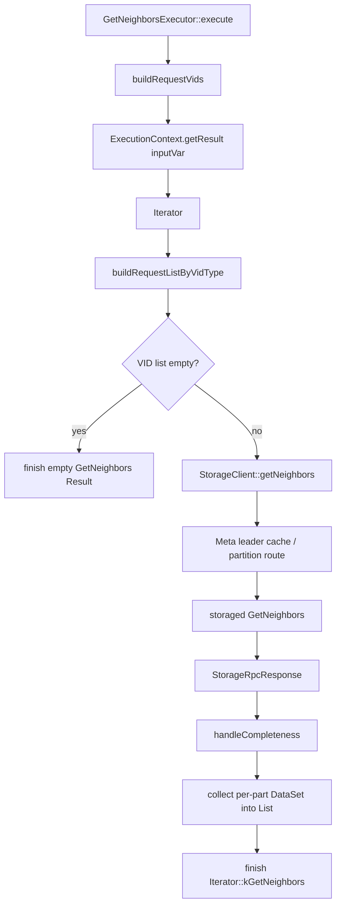

这个算子通常是 **Storage CPU/I/O + RPC** 主导，但 Graphd 还承担 VID 表达式计算、去重、响应聚合、profile 统计。

#### GetVertices / GetEdges

二者与 `StorageAccessExecutor` 的公共请求构建逻辑紧密相关：先从 iterator 计算 key/VID，再按 Space VID 类型（INT64 或 STRING）校验并组装 Storage 请求。

#### IndexScan / IndexScanExecutor

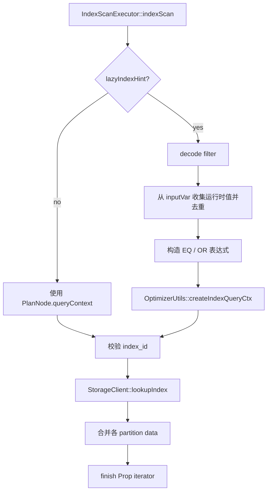

`lazyIndexHint` 很关键：计划生成时索引条件可能依赖上游运行时结果，因此真正的 `IndexQueryContext` 推迟到 Executor 执行时创建。

#### ScanVertices / ScanEdges / FulltextIndexScan

这三类也是“把尽量多的 filter/order/limit 送到数据源”的目标节点，所以许多 Optimizer Rule 都围绕它们做 pushdown。

### 5.2 Graph 本地 CPU 型算子

#### FilterExecutor

Filter 有两个重要实现分支：

1. `max_job_size == 1` 或输入是 `GetNeighborsIter`：单任务。
2. 其他 iterator：`runMultiJobs()` 分批并行过滤。

单任务模式又会判断 `movable(inputVar)`：

- **可移动**：复用原 DataSet，并直接 `erase/unstableErase`，避免复制；
- **不可移动**：重新构造 DataSet，只复制通过的行。

这意味着同一条 Filter 的 CPU/内存行为会受 **Variable.userCount / lifetime optimize** 影响。

#### ProjectExecutor

Project 对每一行、每一个 YieldColumn 调 `expr()->eval(ctx(iter))`，结果写入新 Row。列多、表达式复杂、行数大时，是纯 Graph CPU 热点。

#### AggregateExecutor

核心容器：

```cpp
std::unordered_map<List,
    std::vector<std::unique_ptr<AggData>>,
    std::hash<nebula::List>> result;
```

因此高基数 GROUP BY 的典型风险是：

- hash 计算多；
- Group key / AggData 数量大；
- Graphd 内存增长；
- 最后 materialize DataSet 再有一轮分配。

特殊优化：无 group key 且只有 `COUNT(*)` 时，直接返回 `iter->size()`。

#### Sort / TopN / Limit

`TopNRule` 能把 `Limit(offset=0) <- Sort` 改成 `TopN`，其意义不是“语法合并”，而是避免先把全量数据完全排序再截断。

#### Join / Apply

- `HashInnerJoin` / `HashLeftJoin`：Graph 本地 hash build/probe；
- `CrossJoin`：行数乘法风险最大；
- `InnerJoin`：老式变量版本 join；
- `RollUpApply` / `PatternApply` / `Argument`：MATCH 相关子计划和 pattern predicate 的关键结构。

### 5.3 路径算法型算子

#### TraverseExecutor：Graph 侧多步遍历的核心

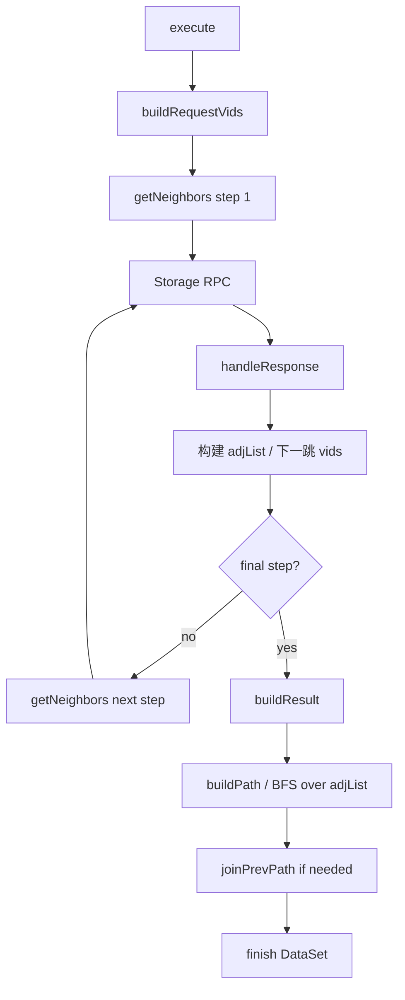

这里要分清两个 BFS：

- **获取邻接数据阶段**：每一步对 storaged 发 getNeighbors；
- **结果构造阶段**：Graphd 对已经收集的 `adjList_` 做 `buildPath()`，用队列展开路径并检查重复边。

因此多跳 MATCH/Traverse 不只是 Storage 压力，也可能是明显 Graph CPU/内存热点。

源码审查提示：`expandOneStep()` 中当前分支写成 `numRows < traverse_parallel_threshold_rows` 时走 `asyncExpandOneStep()`，而大于等于阈值时走串行构建路径。这个行为与 flag 名称“parallel_threshold_rows”的直觉并不一致；排查并行收益时应以源码实际分支为准。

#### BFSShortestPath / MultiShortestPath / ShortestPath / AllPaths

这些节点都把“Storage 邻接读取”和“Graph 算法状态”结合起来。一般性能风险来自：步数、分支因子、起终点对数、路径去环/重复边检查、属性携带量。

---
## 6. 维护/写入/Admin 节点与 Executor 映射

这类节点通常不参与复杂查询优化，但仍然走同一套 `PlanNode -> Executor -> Scheduler` 框架。

### 6.1 写入链路

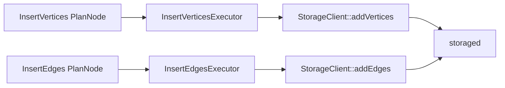

Insert Executor 自身逻辑很薄，主要负责 CommonRequestParam 和 RPC。真正的写冲突、索引维护、KV 写入发生在 Storage 模块。

### 6.2 DeleteEdges 的一个关键细节

Graph 侧收到一条逻辑边删除时会构造两条 EdgeKey：

```text
正向: src -> dst, edge_type = +T
反向: dst -> src, edge_type = -T
```

然后一起交给 `StorageClient::deleteEdges`。因此“按 GO 找到出边后删除”最终仍可删除 Nebula 底层保存的正/反两个方向 key，前提是输入 EdgeKey 被正确构造。

### 6.3 Meta/Admin

Schema、Index、User、Zone、Listener、Session、Config 等 Executor 大多把 PlanNode 参数翻译成 MetaClient/SessionManager 调用，计算量通常不在 Graph 本地数据迭代，而在 RPC 和 Meta 状态机。

---
## 7. Validator 与 Planner：AST 如何变成执行计划

### 7.1 Validator 工厂

`Validator::makeValidator()` 按 `Sentence::Kind` 分派。例如：

```text
GO              -> GoValidator
MATCH           -> MatchValidator
LOOKUP          -> LookupValidator
FETCH VERTEX    -> FetchVerticesValidator
FETCH EDGE      -> FetchEdgesValidator
FIND PATH       -> FindPathValidator
GET SUBGRAPH    -> GetSubgraphValidator
INSERT/DELETE   -> MutateValidator 的具体实现
DDL/Admin       -> Maintain/Admin/ACL Validator
```

Validator 做的并不只是语法检查：

- 校验 Space、VID 类型；
- 推导 Expression 类型；
- 收集引用的 Tag/Edge 属性；
- 检查权限；
- 生成 AstContext；
- 最后调用 Planner 生成 SubPlan。

### 7.2 Planner::toPlan

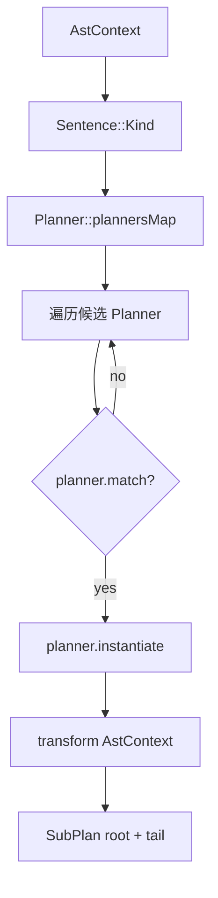

`SubPlan` 的 `root` 是后续执行的上端，`tail` 用于继续拼接 pipeline。必要时 `appendStartNode()` 会给尾部补 `StartNode`。

---
## 8. Executor 工厂、ExecutionContext 与结果生命周期

### 8.1 PlanNode DAG 转 Executor DAG

`Executor::create(root,qctx)` 使用 `visited<nodeId, Executor*>` 防止同一个 PlanNode 因 DAG 共享依赖而重复创建。普通 dependency 递归创建；`Select` 和 `Loop` 的 body 因不在普通 dependency 列表中，需要单独递归。

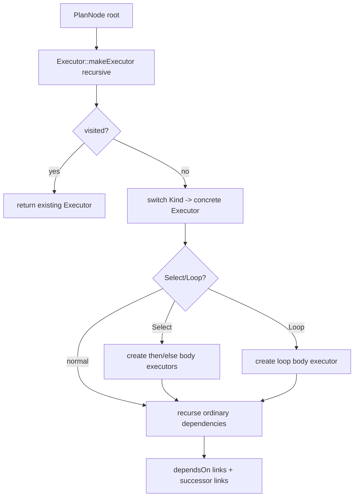

### 8.2 open / execute / close

所有算子统一生命周期：

```text
open()   : kill 检查、内存高水位检查、profile 计数清零
execute(): 具体算子逻辑
close()  : 汇总 totalDuration/rows/execDuration/otherStats 到 ExecutionPlan
```

### 8.3 finish() 是数据流和内存释放的交汇点

核心逻辑：

1. 如果输出变量还有消费者，结果写进 `ExecutionContext`；
2. 若没有消费者，可直接丢弃输出；
3. lifetime optimize 开启时，对当前节点输入变量执行 `drop()`；
4. `Variable.userCount` 减到 0 时，`ExecutionContext::dropResult()` 释放上游结果。

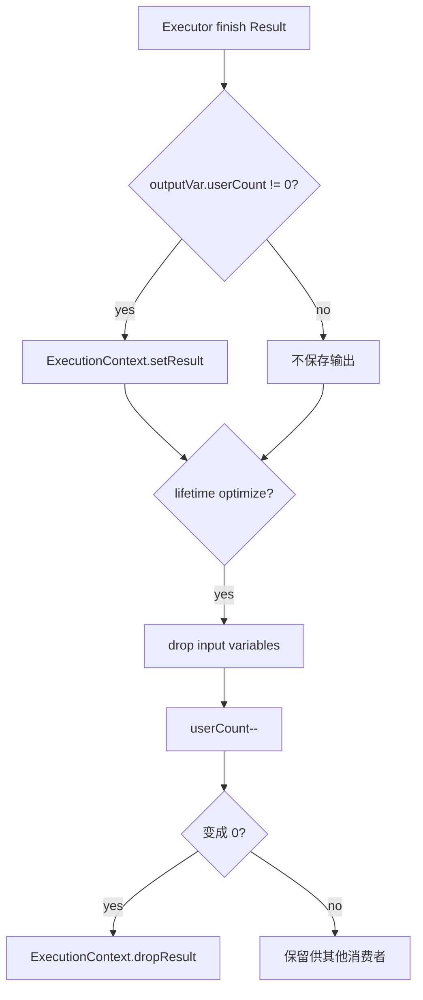

这直接决定 Filter 等算子能否“原地修改”输入。

---
## 9. Scheduler：Executor DAG 如何异步执行

### 9.1 生命周期预分析

`Scheduler::analyzeLifetime()` 在真正调度前遍历计划：

- 每看到一个 input Variable，就 `userCount++`；
- 给节点记录 `loopLayers`；
- Select/Loop 输出变量 userCount 设为最大值，避免被普通生命周期逻辑提前释放；
- 递归 branch/body。

### 9.2 Promise/Future 依赖图

`AsyncMsgNotifyBasedScheduler::doSchedule()` 不是简单 DFS execute，而是：

1. 第一遍 BFS 创建“子节点完成 -> 父节点 Future ready”的 Promise/Future 关系；
2. 第二遍为所有 Executor 注册 future chain；
3. 某个 Executor 所有依赖成功后才执行；
4. 完成后给它的所有父节点 Promise `setValue(Status::OK())`。

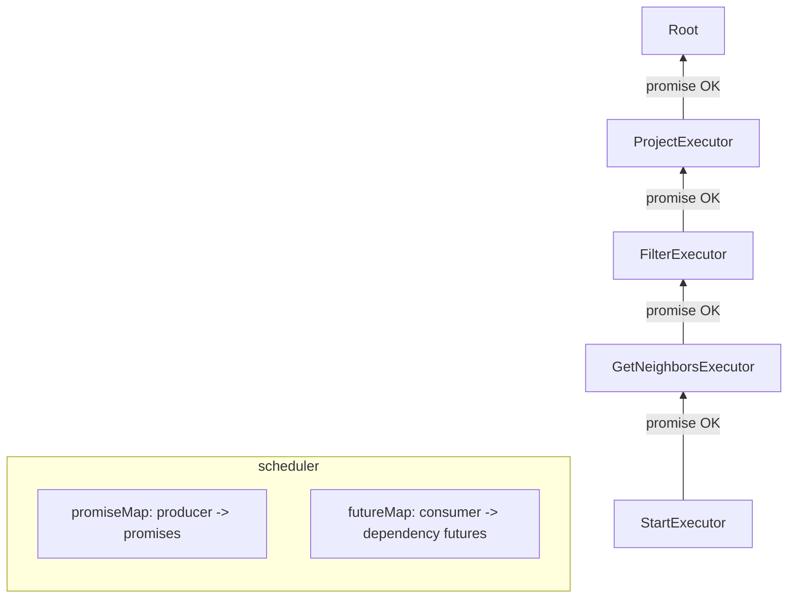

### 9.3 三个特殊节点

- **Argument**：不依赖普通 executor.depends；Scheduler 根据 `inputVar -> SymbolTable.writtenBy` 找生产者。
- **Select**：先执行条件节点，读取 bool，然后只递归调度 then 或 else。
- **Loop**：执行条件；true 时调度 body，再递归运行 Loop；false 结束。

这就是为什么只看 `PlanNode::dependencies()` 有时看不全真实运行关系。

---
## 10. Optimizer：Memo/Group/Pattern/Rule 的完整机制

### 10.1 RuleSet 执行顺序

`QueryEngine::init()` 构造规则集顺序：

```text
DefaultRules                 -- 总是启用
QueryRules0                  -- enable_optimizer=true 时
QueryRules                   -- enable_optimizer=true 时
```

`DefaultRules` 中包含执行必需/规范化类规则，例如 IndexScan 选择；QueryRules 更多是性能重写。

### 10.2 findBestPlan 主流程

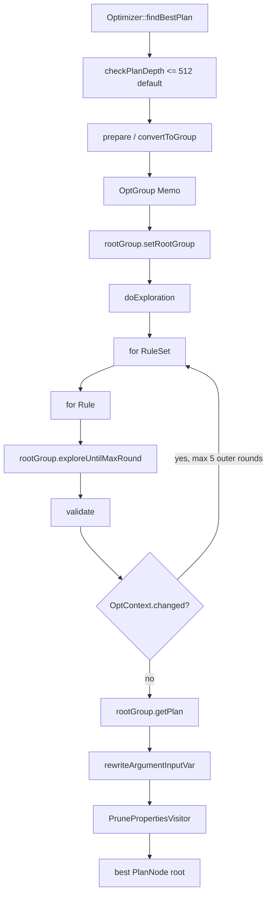

### 10.3 Memo 结构

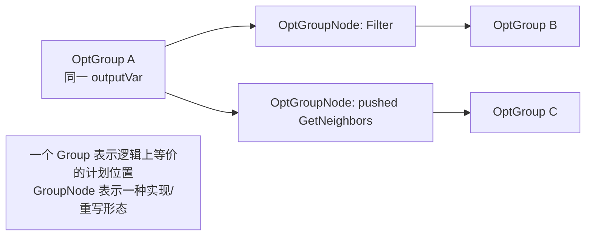

`OptGroup::addGroupNode()` 要求所有 GroupNode 的 `node()->outputVar()` 与 Group 的 `outputVar_` 一致。这是“上层不感知下层 rewrite”的核心不变量。

### 10.4 Pattern 匹配

例如：

```cpp
Pattern::create(kFilter, { Pattern::create(kGetNeighbors) })
```

表示只匹配精确的 `Filter <- GetNeighbors` 形态。Pattern 还会递归检查依赖数量。

### 10.5 为什么 OptRule 还要检查 dataflow

仅仅树形 Pattern 对上并不够。例如一个变量可能被非父节点读取。基础 `OptRule::match()` 会递归验证：

```text
当前 PlanNode.outputVar == 期望 var
PlanNode.inputVar(i) == dependency Group.outputVar
Variable.readBy 中的非 Argument 消费者必须在控制依赖中可解释
```

因此很多“看起来能交换两个节点”的 rewrite，如果会破坏变量引用，就不会被允许。

### 10.6 Cost 模型的现实定位

框架有 `OptGroup::findMinCostGroupNode()` 和 `PlanNode::cost()` 接口，但基础 `PlanNode::calcCost()` 在当前代码中仅记录“unimplemented cost calculation”。因此 3.6 的优化重点应理解为：

- **基于规则的等价重写、pushdown、融合、消除** 是主角；
- Memo/cost 接口为更完整的代价选择留了框架；
- 不应把它想成依赖完整统计信息、自动枚举任意 join order 的成熟 CBO。

---
## 11. release-3.6 优化规则全集

`src/graph/optimizer/CMakeLists.txt` 中可见 **57 个 distinct rule/base 实现单元**；其中 `PushFilterThroughAppendVerticesRule.cpp` 在 CMake 列表中重复出现一次。下表把 base/helper 与具体 rewrite 区分开。

> 注：表中 `DefaultRules` / `QueryRules` 只在已直接核对构造函数的代表规则上作为精确注册信息使用；其余“查询规则/索引规则”等文字是按职责分类，**不等价于断言其构造函数一定注册到同名 RuleSet**。精确启用顺序仍以 `QueryEngine::init()` 和各 Rule 构造函数为准。

| Rule/实现单元 | 类别 | 典型 Pattern | 主要动作 | RuleSet/角色 |
| --- | --- | --- | --- | --- |
| PushFilterDownCrossJoinRule | Filter 下推 | Filter<-CrossJoin | 把能仅由左/右列计算的谓词拆分并分别下推；剩余谓词保留在 Join 上方。 | QueryRules |
| PushFilterDownGetNbrsRule | Filter 下推 | Filter<-GetNeighbors | ExtractFilterExprVisitor 提取可下推表达式，与已有 GN filter 做 AND；无残留时删除 Filter。 | QueryRules |
| RemoveNoopProjectRule | Project 消除 | Project<-QueryNode | 若 Project 只是同名、同序 identity 投影，则复制子节点并复用 Project outputVar。 | QueryRules |
| CombineFilterRule | Filter 化简 | Filter<-Filter | 合并相邻过滤条件，减少一次 Graph 迭代。 | 查询规则 |
| CollapseProjectRule | Project 化简 | Project<-Project | 折叠连续投影并重写表达式引用。 | 查询规则 |
| MergeGetVerticesAndDedupRule | 去重融合 | Dedup/GetVertices | 把可安全的 dedup 语义吸收到 GetVertices 请求/结果处理。 | 查询规则 |
| MergeGetVerticesAndProjectRule | 投影融合 | Project/GetVertices | 把需要的点属性/投影尽量融合进 Storage 获取。 | 查询规则 |
| MergeGetNbrsAndDedupRule | 去重融合 | Dedup/GetNeighbors | 把可安全的 dedup 下沉到邻接查询。 | 查询规则 |
| MergeGetNbrsAndProjectRule | 投影融合 | Project/GetNeighbors | 减少 GetNeighbors 返回的无用列/表达式处理。 | 查询规则 |
| MergeLimitAndFulltextIndexScanRule | Limit 下推 | Limit/FulltextIndexScan | 把 limit/offset 合并到全文检索节点。 | 查询规则 |
| IndexScanRule | 索引选择 | IndexScan | 由 filter 创建 IndexQueryContext；跳过 lazy 或已绑定 index_id 的扫描。 | DefaultRules |
| PushLimitDownGetNeighborsRule | Limit 下推 | Limit/GetNeighbors | 将上层行数约束下推到邻接请求，降低返回量。 | 查询规则 |
| PushLimitDownGetVerticesRule | Limit 下推 | Limit/GetVertices | 将 limit 下推点属性请求。 | 查询规则 |
| PushLimitDownGetEdgesRule | Limit 下推 | Limit/GetEdges | 将 limit 下推边属性请求。 | 查询规则 |
| PushLimitDownFulltextIndexScanRule | Limit 下推 | Limit/FulltextIndexScan | 将 limit 下沉到全文检索。 | 查询规则 |
| PushLimitDownFulltextIndexScanRule2 | Limit 下推 | 变体 | 处理另一种 FulltextIndexScan 上下文/结构。 | 查询规则 |
| PushLimitDownExpandAllRule | Limit 下推 | Limit/ExpandAll | 把可安全限制下推到扩展，减少中间路径。 | 查询规则 |
| PushStepSampleDownGetNeighborsRule | Step 约束 | Sample/GetNeighbors | 把逐步 sample 信息推入 getNeighbors。 | 查询规则 |
| PushStepLimitDownGetNeighborsRule | Step 约束 | Limit/GetNeighbors | 把每步 limit 推入 getNeighbors。 | 查询规则 |
| TopNRule | 算子替换 | Limit(offset=0)<-Sort | 用 TopN 替换 Sort+Limit，避免全量排序。 | QueryRules |
| PushEFilterDownRule | 边过滤下推 | Traverse/Expand | 把边过滤表达式下推到更靠近邻接读取的位置。 | 查询规则 |
| PushFilterDownAggregateRule | Filter 下推 | Filter/Aggregate | 在语义允许时把过滤靠近聚合输入；HAVING 类条件不能盲目下推。 | 查询规则 |
| PushFilterDownProjectRule | Filter 下推 | Filter/Project | 重写列引用后把谓词下推 Project。 | 查询规则 |
| PushFilterDownExpandAllRule | Filter 下推 | Filter/ExpandAll | 将可由扩展数据计算的谓词下推。 | 查询规则 |
| PushFilterDownAllPathsRule | Filter 下推 | Filter/AllPaths | 把路径/步过滤下移到 AllPaths。 | 查询规则 |
| PushFilterDownHashInnerJoinRule | Join Filter | Filter/HashInnerJoin | 按左右列依赖拆分并下推。 | 查询规则 |
| PushFilterDownHashLeftJoinRule | Join Filter | Filter/HashLeftJoin | 在保持 LEFT JOIN null-extension 语义前提下下推可安全谓词。 | 查询规则 |
| PushFilterDownInnerJoinRule | Join Filter | Filter/InnerJoin | 把可安全条件推到 join 输入。 | 查询规则 |
| PushFilterDownNodeRule | 规则基类 | helper | 多种 Filter pushdown 规则的公共实现/工具，不应简单视作独立用户可见 rewrite。 | base/helper |
| PushFilterDownScanVerticesRule | Filter 下推 | Filter/ScanVertices | 将 tag/属性过滤尽量下推到 Storage ScanVertices。 | 查询规则 |
| PushFilterDownTraverseRule | Filter 下推 | Filter/Traverse | 将可安全的表达式下推 Traverse filter/step filter。 | 查询规则 |
| PushVFilterDownScanVerticesRule | 点过滤下推 | vFilter/ScanVertices | 把顶点过滤贴近扫描。 | 查询规则 |
| OptimizeEdgeIndexScanByFilterRule | 索引优化 | Filter/EdgeIndexScan | 根据边过滤条件收紧索引范围/上下文。 | 索引规则 |
| OptimizeTagIndexScanByFilterRule | 索引优化 | Filter/TagIndexScan | 根据 Tag 过滤条件收紧索引范围/上下文。 | 索引规则 |
| UnionAllIndexScanBaseRule | 规则基类 | helper | OR/多索引扫描拆分为 UnionAll 的公共逻辑。 | base/helper |
| UnionAllTagIndexScanRule | 索引改写 | Tag index OR | 将可拆分的 Tag 条件变成多个 index scan + UnionAll。 | 索引规则 |
| UnionAllEdgeIndexScanRule | 索引改写 | Edge index OR | 将可拆分的 Edge 条件变成多个 index scan + UnionAll。 | 索引规则 |
| GeoPredicateIndexScanBaseRule | 规则基类 | helper | 地理谓词索引转换的公共逻辑。 | base/helper |
| GeoPredicateTagIndexScanRule | Geo 索引 | Tag geo predicate | 把可用地理索引的 Tag 谓词转换成 index scan。 | 索引规则 |
| GeoPredicateEdgeIndexScanRule | Geo 索引 | Edge geo predicate | 把可用地理索引的 Edge 谓词转换成 index scan。 | 索引规则 |
| IndexFullScanBaseRule | 规则基类 | helper | FullScan 逻辑节点规范化为可执行 IndexScan 的公共逻辑。 | base/helper |
| TagIndexFullScanRule | Full Scan | TagIndexFullScan | DefaultRules；由 Tag logical full scan 构造实际 IndexScan。 | DefaultRules |
| EdgeIndexFullScanRule | Full Scan | EdgeIndexFullScan | Edge 对应的 full index scan 规范化。 | Default/索引规则 |
| PushLimitDownIndexScanRule | Limit 下推 | Limit/IndexScan | 将 limit 直接送入 lookupIndex。 | 查询规则 |
| PushLimitDownProjectRule | Limit 下推 | Limit/Project | 在投影不改变行数时交换/下推 Limit。 | 查询规则 |
| PushLimitDownAllPathsRule | Limit 下推 | Limit/AllPaths | 把路径结果上限推到 AllPaths。 | 查询规则 |
| EliminateRowCollectRule | 结构消除 | DataCollect | 移除不必要的 row collect 中间节点，减少复制。 | 查询规则 |
| PushLimitDownScanAppendVerticesRule | Limit 下推 | Limit/Scan+AppendVertices | 减少 Scan/补点路径的中间行。 | 查询规则 |
| GetEdgesTransformAppendVerticesLimitRule | 结构重写 | GetEdges/AppendVertices/Limit | 针对边获取+补点+limit 的 MATCH 形态生成更低成本结构。 | 查询规则 |
| GetEdgesTransformRule | 结构重写 | GetEdges pattern | 改写某些 GetEdges 计划形态以匹配更高效执行路径。 | 查询规则 |
| PushLimitDownScanEdgesAppendVerticesRule | Limit 下推 | Limit/ScanEdges/AppendVertices | 限制尽量进入 ScanEdges。 | 查询规则 |
| PushTopNDownIndexScanRule | TopN 下推 | TopN/IndexScan | 利用索引 orderBy+limit 减少 Graph 排序数据量。 | 查询规则 |
| PushLimitDownScanEdgesRule | Limit 下推 | Limit/ScanEdges | 将 limit 下推 ScanEdges。 | 查询规则 |
| PushFilterThroughAppendVerticesRule | Filter 下推 | Filter/AppendVertices | 把不依赖补充点属性的谓词穿过 AppendVertices。 | 查询规则 |
| RemoveAppendVerticesBelowJoinRule | 结构消除 | Join/AppendVertices | 在 Join 下方补点冗余时移除，减少 Storage RPC。 | 查询规则 |
| EmbedEdgeAllPredIntoTraverseRule | 路径谓词 | edge all predicate/Traverse | 把 edge-all predicate 嵌入 Traverse，尽早剪枝。 | 查询规则 |
| EliminateFilterRule | Filter 消除 | Filter | 消除恒真/无效属性等可证明无作用的 Filter。 | 查询规则 |

### 11.1 五类优化的性能含义

1. **Filter pushdown**：越早过滤，越少 RPC 返回、越少 Graph 中间行。
2. **Projection/property pruning**：越少属性，Storage 解码/网络/Graph Value 分配都越少。
3. **Limit/TopN pushdown**：控制基数，尤其对扩展、索引、全文、排序重要。
4. **Index rewrite**：把 Scan/Filter 变成有上下界/前缀/地理条件的索引请求。
5. **结构消除/融合**：删除无意义 Project/DataCollect/AppendVertices，减少一次甚至多次完整 DataSet 遍历。

### 11.2 三个代表性规则的 before/after

#### PushFilterDownGetNbrsRule

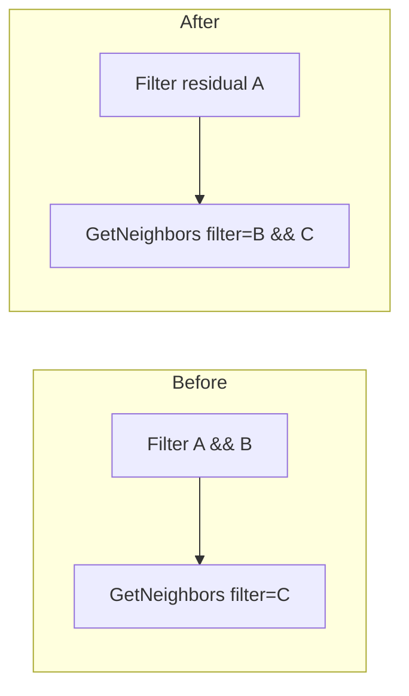

若全部条件都可下推，则 After 只剩 `GetNeighbors(filter=A&&B&&C)`，并复用原 Filter 的 outputVar。

#### TopNRule

```text
Limit(0,N) <- Sort(factors) <- X
              |
              v
TopN(factors,0,N) <- X
```

#### RemoveNoopProjectRule

```text
Project($-.a AS a, $-.b AS b) <- Child[a,b]
                |
                v
Child clone, but outputVar = old Project.outputVar
```

---
## 12. 关键源码方法逐行解析

> 本节不是机械解释所有 getter/setter，而是对真正决定执行链语义的方法逐语句拆解。代码为 release-3.6 逻辑摘录/等价缩写，阅读时以对应源码文件为准。

### 12.1 QueryInstance::validateAndOptimize()

```cpp
1  auto result = GQLParser(qctx()).parse(rctx->query());
2  NG_RETURN_IF_ERROR(result);
3  sentence_ = std::move(result).value();
4  ...统计 sentence 数...
5  NG_RETURN_IF_ERROR(Validator::validate(sentence_.get(), qctx()));
6  if (auto status = findBestPlan(); !status.ok()) { ... }
7  ...记录 optimizer latency...
8  return Status::OK();
```

逐行：

1. Parser 输入原始字符串，输出 `Sentence` AST。此时没有 PlanNode。
2. 语法错误在这里直接终止。
3. QueryInstance 持有 AST 生命周期，后面的 EXPLAIN 判断还需要它。
4. 仅做统计，不改变计划。
5. Validator 不只验证，还最终把 `qctx->plan()->root` 建出来。
6. Optimizer 以当前 root 为输入，得到重写后的 root 并覆盖 ExecutionPlan root。
7. PROFILE/metrics 可看到优化阶段耗时。
8. 此时才进入 Scheduler。

### 12.2 Validator::validate() -> toPlan()

```cpp
1  check vctx / sentence / space
2  space_ = vctx_->whichSpace();
3  vidType_ = SchemaUtil::propTypeToValueType(...);
4  validateImpl();
5  checkDuplicateColName();
6  checkPermission();
7  toPlan();
```

- 1~3：建立所有语义检查所需的 Space/VID 类型上下文。
- 4：具体 Validator（GO/MATCH/LOOKUP/...）解析 clause、表达式、属性需求，构造 AstContext。
- 5：避免 pipeline/变量产生重复列名造成运行时歧义。
- 6：权限检查放在 validateImpl 后，因为很多权限对象信息要先被解析出来。
- 7：`Planner::toPlan(astCtx)` 才真正产生 `SubPlan{root,tail}`。

### 12.3 Planner::toPlan()

```cpp
1  auto planners = plannersMap().find(sentence->kind());
2  if (planners == end) return Error;
3  for (auto& planner : planners->second) {
4      if (planner.match(astCtx)) {
5          return planner.instantiate()->transform(astCtx);
6      }
7  }
8  return Error;
```

- 1：一个 Sentence Kind 可以注册多个 Planner。
- 3~5：不是固定一对一；先 `match` 再选能处理当前 AstContext 的实现。
- 5：`transform` 生成 PlanNode DAG，并返回 root/tail。

### 12.4 PlanNode 构造函数

```cpp
1  id_ = qctx_->genId();
2  varName = "__<Kind>_<id>";
3  variable = symTable->newVariable(varName);
4  outputVar_ = variable;
5  symTable->writtenBy(varName, this);
```

每个 PlanNode 在出生时同时完成“节点身份”和“数据流生产者身份”注册。优化器 clone 一个节点时会得到新 id/new outputVar，之后若它要替换旧节点，通常必须显式 `setOutputVar(old->outputVar())`。

### 12.5 Optimizer::findBestPlan()

```cpp
1  OptContext ctx(qctx);
2  root = qctx->plan()->root();
3  checkPlanDepth(root);
4  rootGroup = prepare(ctx, root);
5  rootGroup->setRootGroup();
6  doExploration(ctx, rootGroup);
7  newRoot = rootGroup->getPlan();
8  postprocess(newRoot, qctx, spaceId);
9  return newRoot;
```

- 3：默认最大普通 dependency 深度 512，避免病态计划递归/遍历。
- 4：原始 PlanNode DAG 转成 Memo。visited map 让共享节点只对应一个 Group。
- 6：所有规则按 RuleSet 顺序反复探索。
- 7：每个 Group 选 cost 最低 GroupNode 并递归恢复 PlanNode DAG。
- 8：修复 `Argument.inputVar`，再做 Property Pruner。

### 12.6 Optimizer::doExploration()

```cpp
1  int8_t appliedTimes = 5;
2  while (octx->changed()) {
3      if (--appliedTimes < 0) break;
4      octx->setChanged(false);
5      for (ruleSet : ruleSets_)
6        for (rule : ruleSet->rules()) {
7          rootGroup->exploreUntilMaxRound(rule);
8          rootGroup->validate(rule);
9          rootGroup->setUnexplored(rule);
10       }
11 }
```

- 外层最多 5 轮，防止规则互相触发后无限震荡。
- 每条 rule 内部还有 `exploreUntilMaxRound` 的局部轮数上限。
- 每条规则后 `validate()` 用来发现 rewrite 生成了非法依赖/Group。
- `setUnexplored(rule)` 让后续新的等价节点在下一轮仍有机会再次应用这条规则。

### 12.7 OptGroup::explore(rule)

```cpp
1  if (isExplored(rule)) return OK;
2  setExplored(rule);
3  for groupNode in groupNodes_ {
4      groupNode->explore(rule);          // bottom-up
5      matched = rule->match(ctx_, groupNode);
6      if (!matched) continue;
7      ctx_->setChanged(true);
8      result = rule->transform(ctx_, matched);
9      if (result.eraseAll) { release old; replace all; break; }
10     add result.newGroupNodes;
11     if (result.eraseCurr) release+erase current;
12 }
```

- 4：先优化依赖，再匹配父节点，属于 bottom-up exploration。
- 5：包含 Pattern 和 dataflow 安全检查。
- 9：`eraseAll` 是“这个 Group 只保留新实现”；`eraseCurr` 是删除当前实现但可保留其它等价实现。
- release 不只是删对象，还会 `releaseSymbols()`，防止 SymbolTable 残留幽灵读写者。

### 12.8 Executor::create / makeExecutor

```cpp
1  visited = {}
2  return makeExecutor(root, qctx, &visited)

3  if visited[node.id] return existing
4  exec = makeExecutor(qctx,node)   // Kind switch
5  if Select: create then/else bodies
6  else if Loop: create body
7  for each normal dep:
8      exec->dependsOn(makeExecutor(dep))
9  visited[node.id] = exec
10 return exec
```

DAG 共享依赖不会创建两个 Executor。`dependsOn` 同时写 `depends_` 和被依赖节点的 `successors_`。

### 12.9 Executor::finish(Result&&)

```cpp
1  if (!lifetimeOptimize || output.userCount != 0) {
2      numRows_ = result.size();
3      result.checkMemory(isQueryNode);
4      ectx_->setResult(outputVar, move(result));
5  }
6  if (lifetimeOptimize) drop();
7  return OK;
```

- 1：无人消费的中间结果不必进入 ExecutionContext。
- 3：查询节点结果进入内存检查。
- 6：当前节点执行完以后立即尝试释放已到生命周期末端的输入。

### 12.10 AsyncMsgNotifyBasedScheduler::schedule()

```cpp
1  root = qctx_->plan()->root();
2  if (lifetimeOptimize) analyzeLifetime(root);
3  executor = Executor::create(root,qctx);
4  return doSchedule(executor);
```

这四行把“静态计划”正式切成“运行时执行图”：先算变量生命周期，再建 Executor DAG，最后注册 Future。

### 12.11 Scheduler::runSelect()

```cpp
1  collect(dependency futures)
2  checkStatus
3  execute(select)                 // 计算条件并写 output bool
4  val = ectx->getValue(outputVar)
5  if (val) doSchedule(thenBody)
6  else     doSchedule(elseBody)
```

未选择的 branch **不会执行**。lifetime optimize 后续还会专门释放未执行 branch 的变量。

### 12.12 Scheduler::runLoop()

```cpp
1  wait dependencies
2  execute(loop condition)
3  if false return OK
4  doSchedule(loopBody)
5  runLoop(bodyFuture, loop, runner)
```

Loop 是 Future 链上的递归，而不是一次性把 N 次 body 全展开成 PlanNode。

---
## 13. 核心算子源码深挖

### 13.1 GetNeighborsExecutor::execute() 逐阶段

```cpp
1  res = buildRequestVids();
2  vids = move(res.value());
3  if empty -> finish(empty GetNeighbors list)
4  CommonRequestParam(space, session, plan, profile)
5  storageClient->getNeighbors(... all plan params ...)
6      .via(runner())
7      .ensure(record total_rpc_time)
8      .thenValue(profile each storage response)
9      -> handleResponse(resp)
```

重点：

- `buildRequestVids()` 本身也计入 `execTime_`；
- `via(runner())` 让回调回到 Graph request runner；
- profile 的 `resp[i]` 能看到每个 Storage host 的 latency/rows；
- 真正的过滤是否在 Storage 发生，取决于 Optimizer 是否把条件放入 `gn_->filter()`。

### 13.2 TraverseExecutor::getNeighbors() 逐阶段

```cpp
1  currentStep_++
2  finalStep = isFinalStep()
3  move vids_ -> vector<Value> vids
4  StorageClient::getNeighbors(
5      finalStep ? statProps : nullptr,
6      vertexProps, edgeProps,
7      finalStep ? exprs : nullptr,
8      finalStep ? dedup/random/orderBy/limit : disabled,
9      selectFilter(),
10     firstStep ? tagFilter : nullptr)
11 thenValue: vids_.clear(); handleResponse(resp)
12 thenValue: if !final && !vids_.empty() return getNeighbors();
13            else return buildResult();
```

设计意图：中间步尽量只拿继续扩展所需的数据；最终步才做统计、表达式、最终 limit/order 等。

### 13.3 TraverseExecutor::buildPath()

Graphd 已经拥有 `adjList_` 后：

1. 找起点的一跳邻接边；
2. 生成 one-step path；
3. 若 `maxStep==1` 直接返回；
4. 两个 queue 管理边路径和 node+edge path；
5. 取当前路径末尾 dst；
6. 查 `adjList_[dst]`；
7. 对每条下一跳 edge 检查 `hasSameEdge`，避免同一条边重复进入 path；
8. 复制当前路径并 append edge；
9. step 在 `[min,max]` 时 materialize Row；
10. 推入 queue 继续 BFS；
11. 如 `trackPrevPath`，最终与外层 MATCH 已有路径 join。

这部分完全是 Graph CPU/内存路径，路径数量呈组合爆炸时 Storage QPS 并不是唯一瓶颈。

### 13.4 IndexScanExecutor::lazyIndexHint

运行时索引 hint 的关键用途是 correlated input：

```text
上游结果列 values
   -> 去重
   -> prop == v1 OR prop == v2 OR ...
   -> createIndexQueryCtx
   -> lookupIndex
```

因此执行计划里看到 IndexScan 并不代表所有 index range 在优化期已经固定。

### 13.5 FilterExecutor 原地过滤

`movable(inputVar)==true` 时：

```text
Result 指向上游 Value
Iterator 在原 DataSet 上遍历
false row -> erase/unstableErase
reset iterator
finish 同一个 ValuePtr
```

这是非常重要的 copy avoidance。若一个变量有多个消费者，`userCount>1`，Filter 必须复制，CPU 和内存成本明显不同。

### 13.6 DeleteEdgesExecutor

逐行语义：

1. 从 inputVar iterator 逐行 eval `srcid/dstid/rank/type`；
2. 校验 VID 类型；
3. 构造 `src,dst,+type,rank`；
4. 再构造 `dst,src,-type,rank`；
5. 两个 key 都加入 vector；
6. 一次 `StorageClient::deleteEdges` 发送。

这解释了 Nebula 存储双向边 key 的删除行为。

---
## 14. 典型 nGQL/MATCH 的调用关系

### 14.1 GO FROM ... OVER ... YIELD ...

一种典型计划：

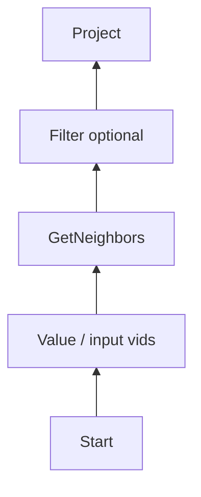

调用栈重点：

```text
GoValidator
 -> Planner
 -> GetNeighbors PlanNode
 -> Optimizer PushFilter/MergeProject/PushLimit...
 -> GetNeighborsExecutor
 -> StorageClient::getNeighbors
 -> storaged
 -> GetNeighborsIter
 -> Filter/Project Executor
```

### 14.2 MATCH 多跳

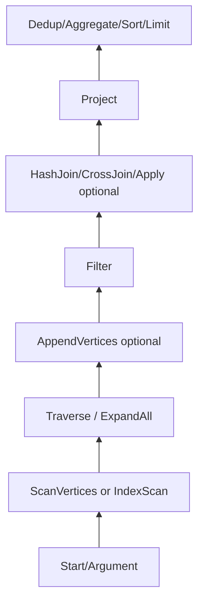

MATCH 性能分析一定要看：

- 起点是 Full Scan 还是 IndexScan；
- Filter 是否进入 Scan/Traverse；
- Traverse 每步 `edgeTypes` 是否过宽；
- 是否产生 CrossJoin；
- AppendVertices 是否被优化掉；
- Project/property pruner 是否减少属性；
- 路径数是否在 Graph 侧爆炸。

### 14.3 LOOKUP ON tag WHERE ...

```text
LookupValidator
 -> IndexScan logical node
 -> Default IndexScanRule 生成 IndexQueryContext
 -> Tag/Edge index optimize rules
 -> Limit/TopN pushdown
 -> IndexScanExecutor
 -> StorageClient::lookupIndex
```

### 14.4 DELETE VERTEX ... WITH EDGE

从 Graph 角度它通常不是一个单独“原子超级算子”，而会包含为了发现关联边而生成的读取/删除计划，再调用删除 Executor。评估性能时要分开看“找边”和“删点/删边”的 Storage 请求量。

---
## 15. 性能分析视角：哪些算子吃 Graph CPU，哪些压 Storage

| 类型 | 代表 PlanNode/Executor | 主要资源 | PROFILE/排查重点 |
| --- | --- | --- | --- |
| 邻接 RPC | GetNeighbors/Traverse/Expand(All) | storaged CPU、RocksDB、网络；Graph 响应解析 | 每 host latency、rows、step[N]、total_rpc_time |
| 属性 RPC | GetVertices/GetEdges/AppendVertices | storaged + 网络 | 返回属性数、VID 数、是否重复补点 |
| 索引 RPC | IndexScan/ScanVertices/ScanEdges | index scan + 网络 | index hint、range、limit/order 是否下推 |
| 过滤/投影 | Filter/Project | graphd CPU | 输入 rows、表达式复杂度、是否 multi-job、是否 movable |
| 聚合 | Aggregate | graphd CPU+内存 | group cardinality、COUNT(*) fast path、AggData 数 |
| 排序 | Sort/TopN | graphd CPU+内存 | 是否触发 TopNRule / PushTopNDownIndexScan |
| Join | HashJoin/CrossJoin/Apply | graphd CPU+内存 | build/probe size、CrossJoin 基数、Filter pushdown |
| 路径 | Traverse/AllPaths/Shortest | 两端都重 | 步数、分支因子、path 数、adjList 大小 |
| 写入 | Insert/Delete/Update | storaged raft/KV/index | batch size、leader route、索引数量、冲突 |
| Meta/Admin | DDL/Zone/User/Config | metad/RPC | Meta leader、job 状态、请求错误 |

### 15.1 从 PROFILE 反推瓶颈

- `execDuration` 高、RPC otherStats 低：Graph 本地算子 CPU。
- `total_rpc_time` 高且 host latency 高：Storage 或网络。
- `rows` 在某个 Traverse/Join 后突然放大：基数爆炸。
- Filter 在 GetNeighbors 上方且没有被下推：Storage 返回过多。
- `Project`/`AppendVertices` 重复出现：检查属性裁剪和 merge/remove 规则是否生效。
- `Sort + Limit` 没有变 `TopN`：检查 offset 是否为 0、规则是否启用。
- IndexScan runtime 报 no index：检查 lazyIndexHint 和运行时构造出的 IndexQueryContext。

### 15.2 Graph CPU 高时优先看哪些 Executor

```text
TraverseExecutor::buildPath / expand
FilterExecutor::handleJob / handleSingleJobFilter
ProjectExecutor::handleJob
AggregateExecutor::execute
SortExecutor / TopNExecutor
Hash*JoinExecutor / CrossJoinExecutor
AllPaths / ShortestPath 系列
```

### 15.3 Storage CPU 高时优先看哪些请求源

```text
GetNeighborsExecutor / TraverseExecutor -> getNeighbors
GetVertices/GetEdges/AppendVertices     -> getProps
IndexScanExecutor                       -> lookupIndex
ScanVertices/ScanEdges                  -> scan
Insert/Delete/Update Executor           -> mutation RPC
```

---
## 16. 源码阅读索引

| 主题 | 从这里开始 | 然后跟进 |
| --- | --- | --- |
| 一条查询完整生命周期 | src/graph/service/QueryInstance.cpp | QueryEngine.cpp -> Validator.cpp -> Planner.cpp -> Optimizer.cpp -> Scheduler |
| 所有计划节点 | src/graph/planner/plan/PlanNode.h | Query.h / Scan.h / Algo.h / Logic.h / Mutate.h / Maintain.h / Admin.h |
| 节点到算子映射 | src/graph/executor/Executor.cpp | 对应 executor 子目录 cpp |
| 变量/结果 | src/graph/context/Symbols.* | ExecutionContext.* / Result.* / Iterator.* |
| 邻接查询 | executor/query/GetNeighborsExecutor.cpp | StorageAccessExecutor.cpp -> clients/storage/StorageClient* |
| 多跳 MATCH | executor/query/TraverseExecutor.cpp | planner/match + optimizer traverse rules |
| 索引 | executor/query/IndexScanExecutor.cpp | optimizer/rule/*Index* + util/OptimizerUtils.* |
| Filter CPU | executor/query/FilterExecutor.cpp | Executor::runMultiJobs / lifetime movable |
| 聚合 CPU/内存 | executor/query/AggregateExecutor.cpp | AggregateExpression/AggData |
| 调度 | scheduler/AsyncMsgNotifyBasedScheduler.cpp | Scheduler.cpp + Executor.cpp |
| 优化器框架 | optimizer/Optimizer.cpp | OptGroup.cpp -> OptRule.cpp -> rule/*.cpp |
| EXPLAIN/PROFILE | planner/plan/ExecutionPlan.cpp | PlanNode::explain + Executor::close |

### 16.1 推荐源码阅读顺序

如果目标是掌握而不是“翻完文件”，建议按下面顺序：

```text
1. QueryInstance::execute / validateAndOptimize
2. Validator::validate / toPlan
3. Planner::toPlan
4. PlanNode.h + PlanNode.cpp
5. Query.h / Logic.h / Algo.h
6. Optimizer::findBestPlan
7. OptGroup::explore
8. OptRule::match + 3~5 个代表 Rule
9. Executor::create + makeExecutor switch
10. AsyncMsgNotifyBasedScheduler::doSchedule
11. Executor::finish + Scheduler::analyzeLifetime
12. GetNeighborsExecutor
13. TraverseExecutor
14. Filter/Project/Aggregate/Join
15. Mutation executors
```

这样读完以后，再看任何具体 Executor，都会知道它处在哪一层、输入从哪里来、输出给谁、优化器能不能改它。

---
## 17. 结论与后续扩展点

### 17.1 最核心的架构结论

1. Graph 3.6 的执行计划是 **DAG + Variable 数据流**，不是简单树。
2. PlanNode 和 Executor 是一对“静态意图 / 运行时实现”，Factory switch 是最可靠映射入口。
3. Scheduler 使用 Future/Promise 按依赖异步触发；Select/Loop/Argument 是三类特殊控制流。
4. Optimizer 是 Memo/Group + Pattern/Rule 的重写框架，Rule pushdown/fusion/elimination 是 3.6 实际性能优化的主力。
5. `outputVar/inputVar + SymbolTable.readBy/writtenBy` 是正确 rewrite 的生命线。
6. `Variable.userCount + Executor::finish/drop/movable` 决定中间 DataSet 是否复制、复用或立即释放。
7. 多跳查询的成本必须拆成 **Storage 邻接 RPC** 和 **Graph 侧路径/Join/Filter 构造** 两部分看。
8. PROFILE 的节点 rows、execDuration、Storage host latency，和上述源码路径能够一一对应。

### 17.2 本文“全量”和“逐行”的边界

- **PlanNode Kind**：按 `PlanNode::Kind` 全量列出 136 个非 Unknown 节点。
- **Executor**：按 `Executor::makeExecutor` 做全量 Kind→Executor 映射；查询核心算子做源码级展开。
- **Optimizer**：列出当前 CMake 中所有 distinct rule/base 实现单元，框架与代表性规则做源码级展开。
- **关键方法逐行**：覆盖 parse/validate/plan/optimize/memo/executor/schedule/lifetime/storage/traverse 等决定整体行为的方法。
- DDL/Admin 类大量 Executor 是参数转发型 Meta RPC；本文完整列名和职责，但没有机械逐行解释每个高度重复的 `MetaClient::xxx()` 包装函数。

这份文档应当作为 Graph 3.6 源码地图使用：当 `EXPLAIN/PROFILE` 出现某个节点时，先查第 4/5/6 节确定它是什么，再查第 8/9 节理解运行时，再查第 10/11 节判断为什么优化器生成了它。

---

## 附录 A：源码快照与可复现性

- Repository: `Bewear777/nebula`
- Branch: `release-3.6`
- Commit: `de9b3ed800a6627d9845e9289b6bbc5b6faf460a`
- 本文分析严格以该快照的 `src/graph` 为主。不同 3.x patch 分支可能新增/删除 Rule、改变 MATCH Planner 或 Executor 细节。

## 附录 B：几个值得单独 code review 的点

1. `TraverseExecutor::expandOneStep()` 的并行阈值分支与 flag 名称直觉相反，建议基准测试确认实际收益。
2. CMake 中 `PushFilterThroughAppendVerticesRule.cpp` 重复列了一次；构建系统通常会处理，但值得清理。
3. 优化器有 cost/Memo 接口，但基础 `calcCost()` 未实现；性能预期应主要围绕具体 rewrite 和数据基数验证，而不是假设存在完整 CBO。
4. Argument 的数据依赖并非普通 dependency，任何自定义 Planner/Rule 改动都应特别检查 `rewriteArgumentInputVar` 与 Scheduler 的 `writtenBy` 解析。
5. 新增 PlanNode 时至少同步检查：`PlanNode::Kind`、`toString`、clone/explain、Executor factory、Visitor、Optimizer pattern、EXPLAIN/PROFILE、必要的 Scheduler 特殊逻辑。
