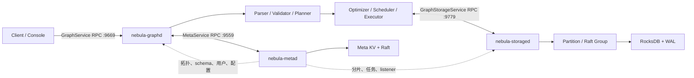

# 总体架构

## 设计主线

NebulaGraph 3.6 把计算、控制面和数据面拆成 `graphd`、`metad`、`storaged` 三类进程。Graph 节点无业务数据持久状态，可独立扩缩；Storage 节点以 partition 为复制和调度单位；Meta 保存全局权威目录，并以 Raft 保证自身元数据的一致性。

## 进程装配

`src/daemons` 是最适合建立全局心智模型的入口：

- `GraphDaemon.cpp` 初始化日志、时区、HTTP 后启动 `GraphServer`；后者装配 `GraphService`、`MetaClient`、会话管理与 `QueryEngine`。
- `MetaDaemon.cpp` 先恢复 Meta KV/Raft，随后启动 HTTP、`JobManager` 与 `MetaServiceHandler`。
- `StorageDaemon.cpp` 规范化数据路径并创建 `StorageServer`；服务端初始化 schema/index 缓存、`NebulaStore`、事务管理和多类 Handler。
- `StandAloneDaemon.cpp` 把三类服务装入同一进程，但仍复用相同逻辑分层。

## 接口边界

| 服务 | Thrift 定义 | 主要调用方 | 服务端实现 |
| --- | --- | --- | --- |
| GraphService | `interface/graph.thrift` | 外部客户端 | `graph/service/GraphService` |
| MetaService | `interface/meta.thrift` | Graph、Storage、工具 | `meta/MetaServiceHandler` |
| GraphStorageService | `interface/storage.thrift` | Graph | `storage/GraphStorageServiceHandler` |
| StorageAdminService | `interface/storage.thrift` | Meta AdminClient | `storage/StorageAdminServiceHandler` |
| InternalStorageService | `interface/storage.thrift` | Storage 节点 | `storage/InternalStorageServiceHandler` |
| RaftexService | `interface/raftex.thrift` | Raft peer | `kvstore/raftex/RaftexService` |

Handler 通常只做 RPC 到 Processor 的分派。Processor 持有请求生命周期，返回 `folly::Future`，并在异步执行结束时填充 Thrift 响应。这样协议层、业务校验、存储事务和线程调度彼此解耦。

## 数据与元数据

- Graph 通过 `MetaClient` 周期性心跳并刷新 schema、索引、space、partition leader、用户角色和配置缓存。
- VID 哈希结合 space 的 partition 数得到目标分区；`StorageClientBase` 按 leader 分组请求，并处理 leader 变化、部分失败和重试。
- Storage Processor 把图语义变为有序 KV key/value。`NebulaKeyUtils`/`MetaKeyUtils` 定义键布局，`codec` 负责属性值布局。
- 每个 Storage partition 对应独立 Raft group 和 WAL；leader 接受写入，将日志复制到多数派后应用到本地 `KVEngine`。
- Meta 也复用 KVStore/Raft，但其键空间承载的是 schema、拓扑、用户、配置和作业状态。

## 并发与生命周期

网络 IO、查询执行、Storage reader、Raft、KV 后台任务和 HTTP 使用不同线程池。Graph 的 `RequestContext`/`QueryContext` 把会话、参数、执行结果和统计贯穿一次请求；执行计划的中间变量由 Scheduler 预计算消费者数量后回收。Storage 的 Processor 将请求按 partition 拆分并聚合部分结果，异常与内存超限在 RPC 入口和异步阶段分别收敛。

## 一致性边界

- Meta 元数据写：以 Meta leader 为线性化入口，Raft 提交后对外完成。
- Storage 单分区写：由该 partition leader 提交 Raft 日志。
- 跨分区/双向边写：transaction/chain processors 协调 prime/double-prime 阶段，并保留恢复路径。
- Graph 本地缓存：以心跳周期刷新，路由错误通过 Storage 返回的 leader 信息触发修正和重试。

## 可观测性与运维

三类 daemon 都启动 WebService，公共端点包含 `/status`、`/stats`、`/flags`。Meta/Storage 追加 checkpoint、属性或管理路由。统计计数器在 RPC Handler、Processor 与 Client 层分别记录请求、延迟、失败和重试。
