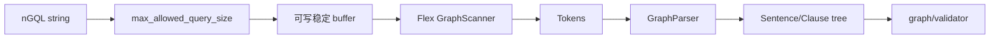

# parser 模块

## 职责

`src/parser` 将 nGQL 文本转为 `Sentence`/Clause AST。`scanner.lex` 负责 token，`parser.yy` 负责语法和 AST 动作；CMake 生成 scanner/parser 源码。各 `*Sentences`、`Clauses` 和 `MatchPath` 类型承载语法结构，不负责 schema 或权限校验。

## 解析流程

`GQLParser::parse` 接管查询字符串，通过回调向 scanner 提供字节。失败时清空 scanner 内部缓冲并销毁半成品 AST；成功后把 `sentences_` 转移为 `unique_ptr<Sentence>`。

## 扩展语法

新增语句通常要同步修改 token/grammar、AST 类型、Graph validator、planner、plan node 与 executor，并补充 parser/validator/executor 测试。不要直接编辑构建生成的 `GraphParser.hpp` 或 scanner 输出。

