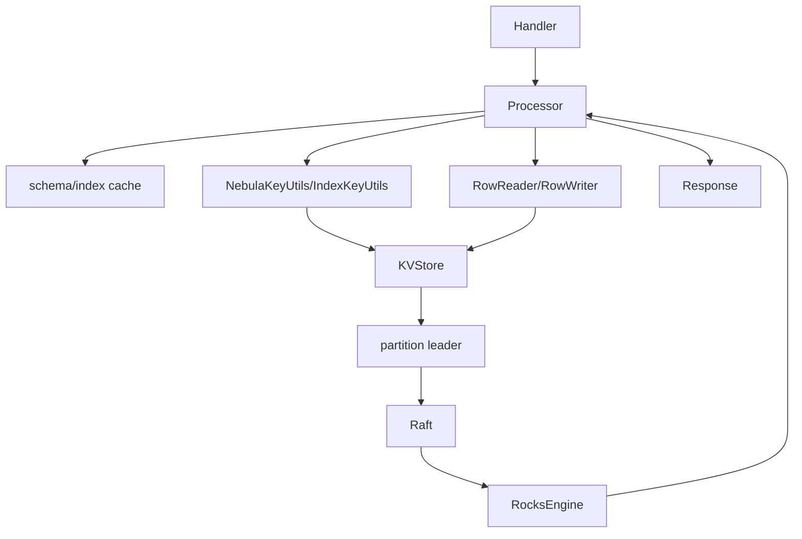

# storage 模块

## 职责与边界

`src/storage` 把图 API 转换为 partition 内的 KV 操作，是 Graph 计算层与 `kvstore` 一致性层之间的图语义适配层。它处理属性行、TTL、索引、条件过滤、扫描、管理任务和跨节点边事务。

## 服务入口

| Handler | 接口 | 用途 |
| --- | --- | --- |
| `GraphStorageServiceHandler` | GraphStorageService | 顶点/边读写、LOOKUP、scan、KV 模式 |
| `StorageAdminServiceHandler` | StorageAdminService | checkpoint、compact、rebuild、leader、space 管理 |
| `InternalStorageServiceHandler` | InternalStorageService | Storage 间的链式事务阶段 |
| HTTP handlers | WebService | stats、admin、property 查询 |

Handler 创建 Processor 并返回其 Future。Processor 通过 `StorageEnv` 访问 KVStore、schema/index manager、事务管理器和线程池。

## 子模块

- `query`：neighbors、props、dst、vertex/edge scan。
- `mutate`：add/update/delete vertex/edge/tag。
- `index` + `exec`：索引计划 DAG、选择、投影、去重、TopN。
- `transaction`：双向边或跨分区更新的 chain protocol 与恢复。
- `admin`：长任务及 checkpoint/flush/compact/ingest。
- `context` / `kv` / `http`：表达式上下文、KV 模式、运维接口。

## 读写下沉

## 事务与错误

普通单分区写由对应 Part 的 Raft 保证一致。边可能需要正反两条记录，chain processor 将操作拆成 prime/double-prime 阶段并保留 resume 路径。响应以 partition 为粒度记录失败；内存超限、leader 变化、schema 不匹配和条件失败均映射为统一 ErrorCode。

