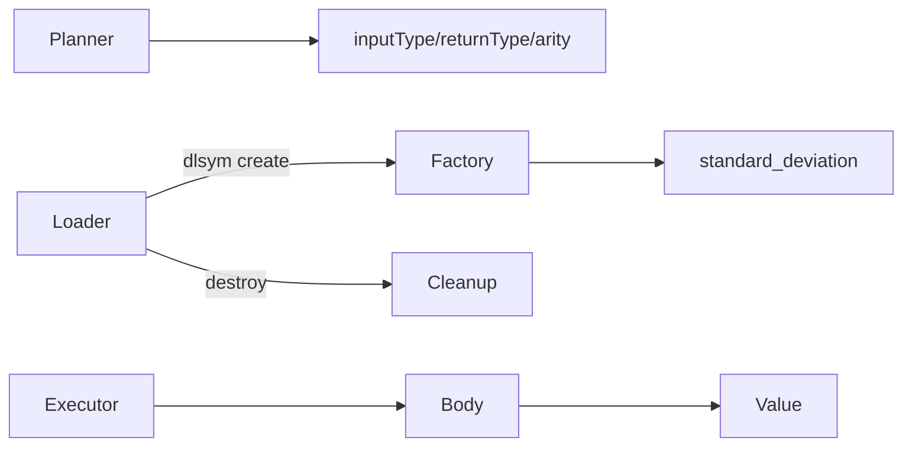

# udf 模块

## 职责

`udf` 展示 Graph 用户函数插件的编译和 ABI。示例 `standard_deviation` 接收一个数值列表并返回总体标准差。

## 插件契约

- 动态库必须导出 C ABI 的 `create` 与 `destroy`，供插件加载器解析。
- `GraphFunction` 实现声明函数名、允许的输入类型、返回类型、最小/最大参数数和纯函数属性。
- `body` 接收 `Value` 引用数组，对 NULL、类型错误和正常值返回 Nebula `Value`。

示例实现的是总体标准差（方差除以 `N`）。生产 UDF 还应显式处理空列表、数值溢出、异常与资源上限；纯函数标记允许规划器安全复用或折叠结果。

