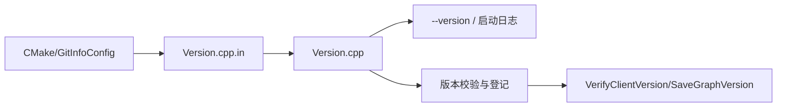

# version 模块

## 职责

`src/version` 暴露发布版本、Git SHA 和构建时间。`Version.cpp.in` 在 CMake 配置阶段注入 `NEBULA_BUILD_VERSION` 与 `GIT_INFO_SHA`，生成最终源文件。

版本不是仅用于展示：Graph/Storage 与 Meta 在启动期会进行兼容性检查，Meta 也保存 Graph 版本供集群管理。打包时缺失版本宏会返回空发布版本，但仍保留构建时间与可选 SHA。

