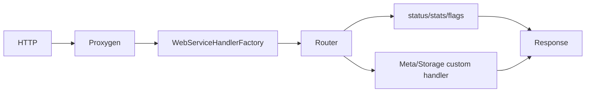

# webservice 模块

## 职责

`src/webservice` 基于 Proxygen 提供轻量 HTTP 运维平面。公共路由包含 `/status`、`/stats`、`/flags`；Meta 与 Storage 在启动时向 Router 注册额外 handler。

## 组件

- `WebService`：构造 HTTPServer、线程和启动同步屏障。
- `Router`：按 HTTP method 与 path 匹配 Handler，并提取路径参数。
- `Get/SetFlagsHandler`：读取或更新允许动态修改的 gflags。
- `GetStatsHandler`：导出 StatsManager 指标。
- `StatusHandler` / `NotFoundHandler`：健康状态与 404。

`start` 在独立 NamedThread 中启动 mainloop，但通过 condition variable 等待 bind 成功或异常，所以 daemon 只有在 HTTP 确实可用后才继续启动。Handler 不应阻塞 EventBase；重操作需转交专用线程池。

